# fishmechr

``` r
library(fishmechr)
#> 
#> Attaching package: 'fishmechr'
#> The following object is masked from 'package:stats':
#> 
#>     deriv
library(dplyr)
#> 
#> Attaching package: 'dplyr'
#> The following objects are masked from 'package:stats':
#> 
#>     filter, lag
#> The following objects are masked from 'package:base':
#> 
#>     intersect, setdiff, setequal, union
library(tidyr)
library(ggplot2)
library(patchwork)
```

## Computing kinematic parameters

To compute midline swimming kinematics accurately, follow the steps
below.

1.  Compute the arc length along the curve of the body.
2.  If the points are not consistently at the same arc length,
    interpolate the points so that each one is at a consistent point on
    the body. It is often useful to do some smoothing as part of this
    step.
3.  Compute a center location. Ideally this is the center of mass, but
    it could be approximated in a variety of ways.
4.  Compute the body curvature or excursion relative to a central axis,
    or both.
5.  Estimate the phase of the oscillation at each point. You can either
    detect peaks and zero crossings or use a mathematical technique
    called the Hilbert transform.
6.  Use temporal and spatial derivatives of the phase to estimate the
    oscillation frequency, body wavelength, and body wave speed.
7.  Based on the phase, identify individual undulation cycles. Within
    each cycle, you can identify the range of body excursion or
    curvature to compute the amplitude.

### 1. Compute arc length

Most kinematic variables are best specified in terms of arc length $s$,
the distance along the body from the head to a particular point $i$:
$$s_{i} = \sum\limits_{j = 1}^{i - 1}\left\lbrack \left( x_{j + 1} - x_{j} \right)^{2} + \left( y_{j + 1} - y_{j} \right)^{2} \right\rbrack,s_{1} = 0$$
Using arc length is better than something like the $x$ coordinate for
two reasons. First, often a fish does not swim precisely along the $x$
axis, which means that the points would need to be rotated. Second, many
fish swim with relatively large amplitude motions, which means that the
distance along the curve is larger than the distance along the swimming
direction, particularly near the tail where amplitudes are higher.

### 2. Interpolate points for a consistent position

Ideally, we want each point to represent a consistent location on the
fish’s body. Particularly with fish that do not have clear landmarks
along the body, we may be able to mark the middle easily between the
left and right side, but at points that may not be consistent along the
fish’s length. We can use a spline to interpolate points at a consistent
location.

Digitized points often have some error. As part of the interpolation
process, we can use a smoothing spline to smooth out some of that error.

### 3. Estimate a center location

The center location is a weighted average location. For a midline
defined by $x$ and $y$ coordinates $\left( x_{i},y_{i} \right)$, there
are four main ways to identify the center location.

1.  If $m_{i}$ is the mass of segment located between
    $\left( x_{i},y_{i} \right)$ and
    $\left( x_{i + 1},y_{i + 1} \right)$, then
    $$x_{com} = \frac{1}{2M}\sum\limits_{i = 1}^{n - 1}m_{i}\left( x_{i + 1} + x_{i} \right)$$$$y_{com} = \frac{1}{2M}\sum\limits_{i = 1}^{n - 1}m_{i}\left( y_{i + 1} + y_{i} \right)$$
    where $M$ is the total mass of the fish. If you know the mass
    distribution but not the true masses of segments, you could also use
    $m_{i}$ as the fraction of the total mass in segment $i$ so that $M$
    would be 1.

2.  If you do not know the mass distribution, then you can approximate
    $m_{i}$ in several ways. The best is to use the width and height of
    the body. If the body, without the fins, has an elliptical cross
    section, where $w_{i}$ is the horizontal width and $h_{i}$ is the
    dorso-ventral height at point $i$, then the volume of the segment
    from $\left( x_{i},y_{i} \right)$ and
    $\left( x_{i + 1},y_{i + 1} \right)$ is
    $$V_{i} = \pi\Delta s_{i}\left( w_{i}h_{i} + \frac{1}{2}\Delta w_{i}h_{i} + \frac{1}{2}\Delta h_{i}w_{i} + \frac{1}{3}\Delta w_{i}\Delta h_{i} \right)$$
    where $\Delta s_{i} = s_{i + 1} - s_{i}$,
    $\Delta w_{i} = w_{i + 1} - w_{i}$, and
    $\Delta h_{i} = h_{i + 1} - h_{i}$. Then we approximate
    $m_{i} \approx \rho V_{i}$, where $\rho$ is the density of the fish,
    which we assume here to be constant, so that
    $$x_{com} = \frac{\sum\limits_{i = 1}^{n - 1}\left\lbrack V_{i}\left( x_{i + 1} + x_{i} \right) \right\rbrack}{2\sum\limits_{i = 1}^{n - 1}V_{i}}$$$$y_{com} = \frac{\sum\limits_{i = 1}^{n - 1}\left\lbrack V_{i}\left( y_{i + 1} + y_{i} \right) \right\rbrack}{2\sum\limits_{i = 1}^{n - 1}V_{i}}$$

3.  Often the width is visible from a camera from above or below, but
    the height is not known. In this case, a reasonable approximation
    (at least for elongate fishes where the height does not vary too
    much) is that $m_{i} \propto w_{i}$, so that
    $$x_{com} = \frac{\sum\limits_{i = 1}^{n}w_{i}x_{i}}{\sum\limits_{i = 1}^{n}w_{i}}$$$$y_{com} = \frac{\sum\limits_{i = 1}^{n}w_{i}y_{i}}{\sum\limits_{i = 1}^{n}w_{i}}$$

4.  Choose one point along the body to use as the center. This could be
    the snout or a point close to the center of mass. This has been
    called the “stretched-straight center of mass”, but tends to give
    inaccurate estimates of velocity or acceleration.

### 4. Estimate curvature or lateral excursion

#### Curvature

The 2D curvature $\kappa$ of the midline in the horizontal plane is
often a useful variable to compute. In particular, it is usually
proportional to the muscle strain at that point on the body (Shadwick
1998, Katz 1999). In contrast, the lateral excursion of the body is not
usually a good estimate of muscle strain (Shadwick 1998).

Mathematically, curvature can be thought of in two different ways.
First, it is the inverse of the radius of curvature: the radius of a
circle drawn through three successive points. The smaller the radius of
curvature, the sharper the body bend, and the larger the value of
$\kappa$. This estimate for curvature is defined by the following
equation
$$\kappa = \left\lbrack \frac{\partial x}{\partial s}\frac{\partial^{2}y}{\partial s^{2}} - \frac{\partial y}{\partial s}\frac{\partial^{2}x}{\partial s^{2}} \right\rbrack\left\lbrack \left( \frac{\partial x}{\partial s} \right)^{2} + \left( \frac{\partial y}{\partial s} \right)^{2} \right\rbrack^{- 3/2}$$

Second, it is the spatial derivative of the angle of each segment. If a
segment at arc length $s$ has an angle $\theta$ to the horizontal axis,
then the curvature is $$\kappa = \frac{\partial\theta}{\partial s}$$ The
angle for segment $i$ is
$\theta_{i} = \tan^{- 1}\left( y_{i + 1} - y_{i},x_{i + 1} - x_{i} \right)$.

Although both formulas are mathematically equivalent, they have slightly
different properties depending on the measurement error on the $x$ and
$y$ positions.

#### Lateral excursion

One can also estimate the body phase, and then the wavelength and wave
speed, based on the excursion of the body relative to a primary axis. We
suggest using the singular value decomposition (SVD) to estimate the
primary axis, then using a low-pass filter to remove any oscillations at
the tail beat frequency or higher. If you have a matrix of $x$ and $y$
coordinates of points along the body at a specific time,
$\mathbf{X}$$$\mathbf{X}_{n \times 2} = \begin{pmatrix}
x_{1} & y_{1} \\
x_{2} & y_{2} \\
\vdots & \vdots \\
x_{n} & y_{n}
\end{pmatrix}$$ where the subscript indicates the size of the matrix
($n$ points along the body by 2).

First, center each axis by subtracting the location of the center of
mass or the mean of each column, to produce a matrix
$\mathbf{X}^{\mathbf{C}}$, centered around 0. Then the singular value
decomposition allows you to write the matrix in the form
$$\mathbf{X}_{n \times 2}^{C} = \mathbf{U}_{n \times n}\mathbf{\Sigma}_{n \times 2}\mathbf{V}_{2 \times 2}^{T}.$$
The matrix $\mathbf{V}_{2 \times 2}$ then represents the principal axes
of the body in that frame. The matrix can be estimated at each time
point, to produce a time-varying matrix $\mathbf{V}(t)$.

Assuming the amplitude is relatively small, the first column of
$\mathbf{V}$ represents a unit vector pointing along the primary axis of
the body (which we call $\widehat{\mathbf{a}}(t)$ and the second column
is a unit vector normal to the primary axis.

We suggest using a low pass filter with a cutoff frequency below the
tail beat frequency to smooth the components of the
$\widehat{\mathbf{a}}(t)$ vector, making sure to normalize it after
smoothing. See implementation details below.

### 5. Estimate phase

To estimate the undulation frequency, body wavelength, and wave speed,
consider a simple equation for the midline. Fish swim using a traveling
wave of curvature $\kappa_{s}$ (or lateral excursion) defined at an arc
length $s$ along the body as
$$\kappa(s,t) = A(s)\cos\left( 2\pi\left\lbrack \frac{s}{\lambda} - ft \right\rbrack \right)$$
where $A(s)$ is the wave amplitude, $k$ is the wave length, $f$ is the
oscillation frequency, and $t$ is time. In this case, the phase of the
oscillation $\phi(s,t)$ at a particular point along the body is
approximately equal to the argument of the cosine,
$2\pi(s/\lambda - ft)$. If the amplitude $A$ varies over quickly over
time or space, this approximation may not be exactly correct.

If we can estimate the phase accurately, then we can use a spatial
(i.e., with respect to $s$) or temporal derivative to estimate
$\lambda$, the body wavelength, or $f$ the undulation frequency.

Below, we describe two methods for estimating phase. Before using either
of these two methods, it may be helpful to add a second smoothing step,
which may even oversmooth the data. Both of the methods require signals
that oscillate around zero and clear peaks. If the oscillations are
offset from zero, or there is noise in the data (particularly if there
are noisy oscillations near the peaks that make it seem that there are
multiple peaks), they will not give good results.

#### Smoothing

Here, we suggest using a bandpass filter on the oscillation of any
individual point. Choose a lower frequency that is less than half the
lowest oscillation frequency and an upper frequency that is about 5-10
times the highest oscillation frequency. The low frequency may be quite
low. Be careful using standard filter design functions (such as the
`butter` function in `pracma`) because these functions use
autoregressive moving averages, which do not perform well for filtering
at very low frequencies. We recommend using the “second order sections”
method, which is more numerically stable. See further details below.

Note that these (over) smoothed results are good to use for estimating
phase, but not for later estimates of tailbeat amplitude or excursion.

#### Use the Hilbert transform

One convenient and relatively robust way to estimate the phase of each
body point involves the use of the Hilbert transform $\mathbf{H}$, a
procedure that uses the Fourier transform to estimate a periodic signal
that is 90deg shifted relative to another. In essence, given a cosine
signal, the Hilbert transform returns the sine with the same amplitude
and frequency. The utility of this operation is that it lets us estimate
the \`\`analytic signal’’, a complex-valued signal where the magnitude
of the complex number is the amplitude of the wave and the phase angle
of the complex number is the phase of the signal.

We can then take the Hilbert transform to estimate the analytic signal
for curvature or lateral excursion
$$\kappa^{*}(s,t) = \kappa(s,t) + i\mathbf{H}\{\kappa(s,t)\}$$ where $i$
is the imaginary number. (Note that the `hilbert` function in R and
Python returns the full analytic signal, not just the imaginary
component as written above). For a complex number $C = a + ib$, the
magnitude is denoted by
${||}C{||} = \left\lbrack a^{2} + b^{2} \right\rbrack^{1/2}$ and the
phase angle is denoted by $\angle C = \tan^{- 1}(b/a)$.

One can also estimate the analytic signal for the lateral excursion of
the body $z(s,t)$, where $z$ is the lateral position of a point on the
body, relative to the overall axis of the body. We suggest using the
singular value decomposition to estimate the central body axis and then
using a low-pass filter with a cutoff frequency lower than the tail beat
frequency to remove the tail beat oscillation, as described above.

The analytic signal thus provides an estimate of the phase can be
estimated as a continuous function of both time and position along the
body. Other techniques for estimating phase require identifying
particular features in the signal (such as peaks or zero crossings) and
therefore do not estimate phase as a continuous signal. The estimated
phase $\widehat{\phi}$ is thus
$$\widehat{\phi}(s,t) = \angle\kappa^{*}(s,t).$$ For a traveling wave,
this phase, as estimated here, is equal to the argument of the cosine
function from the traveling wave equation above,
$\widehat{\phi}(s,t) = 2\pi\lbrack s/\lambda - ft\rbrack$.

#### Numerical considerations for the Hilbert transform

The Hilbert transform only works well for this analysis with signals
that are centered around zero and consist of many relatively smooth
tailbeats. This is why we suggest using the curvature $\kappa$, rather
than something like lateral position or the $y$ coordinate of the body.
To use the Hilbert transform on a lateral position, it is important to
subtract a baseline value or use a high pass filter to ensure that the
signal is centered around zero.

Similarly, if the signal is noisy, the phase $\widehat{\phi}$ will not
increase steadily and the derivatives used to estimate $\widehat{f}$ and
$\widehat{\lambda}$ will not be meaningful. It is best to filter the
input signal using a bandpass or low pass filter so that the
oscillations are smooth.

In most programming languages, one should use a function `atan2` to
estimate phase (not `atan`), because it gives an angle that ranges
around the full circle (rather than 0 to 180 degrees). However, the
output of `atan2` will jump (usually from $\pi$ to $- \pi$) as $t$ or
$s$ increase. To estimate frequency or wavelength, before performing the
derivatives, one should estimate a smoothly increasing phase using a
function `unwrap`, which searches for jumps and removes them.

#### Detect peaks and zero crossings

We can also estimate a phase by detecting specific features in the
oscillation, such as peaks or zero crossings, and then interpolating a
continuous value for the phase using a spline curve. For a cosine
function, as above, a positive peak has phase $\widehat{\phi} = 0$, a
downward zero crossing has phase $\pi/2$, a negative peak (i.e., a
trough) has phase $\pi$, and an upward zero crossing has phase $3\pi/2$.
By identifying these features and their corresponding phases, one can
then interpolate a continuous phase.

Using this method requires careful error checking. In particular, peaks
can be identified erroneously, particularly if there is noise in the
signal. We recommend using a strong smoothing filter on the curvature or
lateral excursion before estimating phase. See examples and numerical
details below.

### 6. Use the phase to estimate frequency and wavelength

We can then use the estimated phase to compute the frequency and
wavelength by taking derivatives in time or space, respectively,
$$\widehat{f}(t) = \frac{1}{2\pi}\frac{\partial}{\partial t}\widehat{\phi}(s,t)$$
Estimated this way, frequency should be the same at every point along
the body. Therefore, you can average $\widehat{f}$ across the body or
choose a single point along the body (usually the tail) to use as the
estimate of frequency.

$${\widehat{\lambda}}_{s}(t) = 2\pi\left( \frac{\partial}{\partial s}\widehat{\phi}(s,t) \right)^{- 1}$$

The body wave speed $\widehat{V}$ is the product of the two:
$$\widehat{V}(t) = \widehat{\lambda}(s,t)\widehat{f}(t)$$

### 7. Quantify swimming parameters on a cycle-by-cycle basis

Once you have estimated a good undulation phase, it is straightforward
to quantify other parameters that vary every cycle. Usually, we need to
define an overall phase of the entire body oscillation. It’s best to
choose the most reliable phase estimate, which is usually the phase of
the tail tip or a point near the tail (e.g., $\widehat{phi}(L,t)$, where
$L$ is the body length).

As phase increases past $2\pi$, it will jump back to 0. Most programming
languages have a functioned called `unwrap` that looks for those jumps
and removes them, producing a steadily increasing phase, which we will
refer to as ${\widehat{\Phi}}_{c}(t)$. Then the cycle number is
$$C(t) = \left\lfloor {\widehat{\Phi}}_{c}(t)/(2\pi) \right\rfloor$$
where the L brackets denote the `floor` operation, or rounding down to
the next lowest integer value.

For example, to find the body amplitude, search within each cycle to
find the range of motion for each body point, and divide by two. See
details below.

## Example analysis of a lamprey data set

### Data structure

The data set `lampreydata` is included in the `fishmechr` package. Most
swimming kinematics data sets should have a similar structure:

- A time or frame column. It’s often good to keep both in the data set.
  (Here, these are in `t` and `frame`)
- A column that identifies the point on the body. This could be a factor
  variable, with names of each body part (like returned by Sleap or
  DeepLabCut), as long as there is a clear order from head to tail. Or
  it could be a numeric variable, with points numbered from 1 to $n$,
  where 1 is the snout and $n$ is the tail. (here this is in `point`).
- x and y coordinates of the point. Currently, these algorithms are only
  designed to work on 2D movements in the horizontal plane. (here these
  are in `mxmm` and `mymm`, indicating “midline” x and y points in mm)

``` r
head(lampreydata)
#>      t frame point mxmm mymm
#> 1 0.02     1     1   NA   NA
#> 2 0.02     1     2   NA   NA
#> 3 0.02     1     3   NA   NA
#> 4 0.02     1     4   NA   NA
#> 5 0.02     1     5   NA   NA
#> 6 0.02     1     6   NA   NA
```

This plot shows the midlines in two frames.

``` r
lampreydata |> 
  filter(frame %in% c(10, 20)) |> 
  mutate(frame = factor(frame)) |> 
  ggplot(aes(x = mxmm, mymm, color = frame, group = frame)) +
  geom_path() +
  coord_fixed()
```

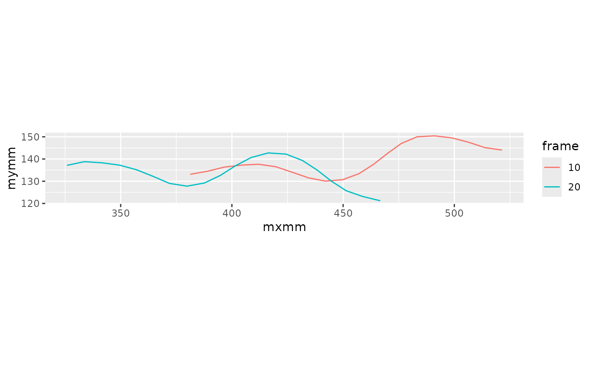

## Kinematics process

### Compute arc length

``` r
lampreydata <-
  lampreydata |> 
  group_by(frame) |>
  mutate(arclen0 = arclength(mxmm, mymm)) 
```

Here we plot the arc length of a few points along the body. We can see
that they’re generally in the same location, but not exactly, so we’ll
need to interpolate so that they’re in the same place.

``` r
lampreydata |> 
  ungroup() |> 
  filter(point %in% c(5, 10, 18)) |> 
  ggplot(aes(x = t, y = arclen0, color = point)) +
  geom_point()
#> Warning: Removed 6 rows containing missing values or values outside the scale range
#> (`geom_point()`).
```

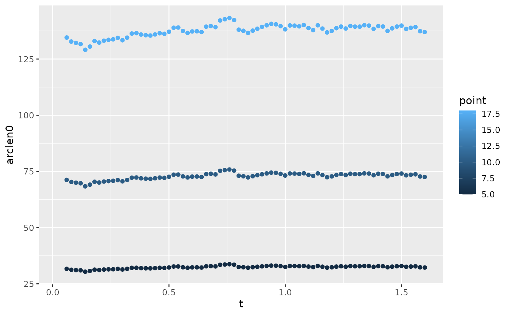 Here’s the
interpolation.

``` r
lampreydata <- lampreydata |> 
  interpolate_points_df(arclen0, mxmm, mymm, spar = 0.2,
                        tailmethod = 'extrapolate',
                        .out = c(arclen='arclen', xs='mxmm_s', ys='mymm_s'))
```

Now the points are always at the same arc length. Sometimes this
requires extrapolating to get the tail position.

``` r
lampreydata |> 
  filter(frame %in% c(10, 20)) |> 
  mutate(frame = factor(frame)) |> 
  ggplot(aes(x = mxmm, mymm, color = frame, group = frame)) +
  geom_point(shape = 10) +
  geom_path() +
  geom_point(aes(x = mxmm_s, y = mymm_s), shape = 5) +
  coord_fixed()
```

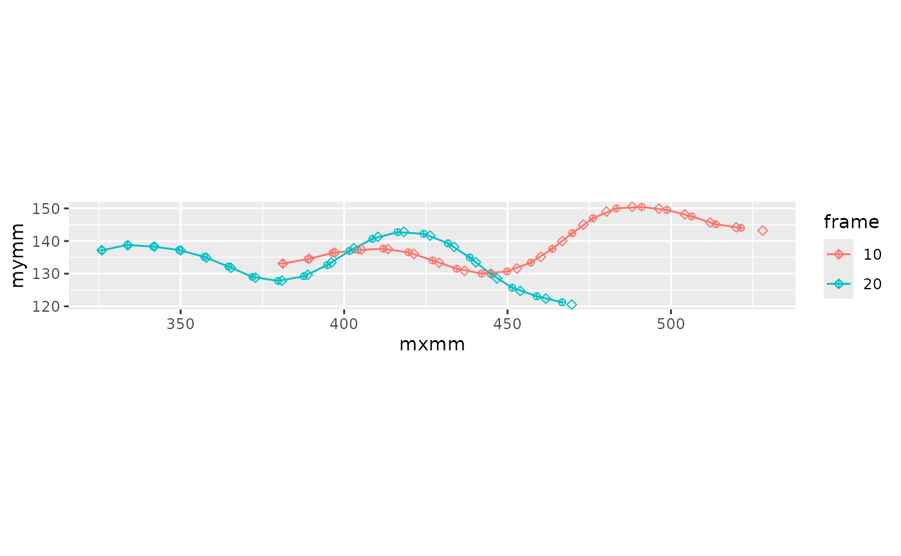

### Get the width

I have digitized the width of an ammocoete from the ventral view. We
assume here that the width is the distance from one lateral edge to the
other (like a diameter), not the distance from the center to an edge
(like a radius). Here it’s expressed in terms of body lengths, both
along the body and for the width itself.

Initially, the width is in a separate data frame. It should have a
column for arclength (here, `s`) and a column for width. This one has
columns for eels and ammocoetes. It’s simplest if `s` and width are both
normalized relative to body length (so `s` should range from 0 to 1, and
width should be around 0.05-0.1 BL for most fishes).

``` r
fishwidth
#> # A tibble: 20 × 3
#>         s eelwidth ammowidth
#>     <dbl>    <dbl>     <dbl>
#>  1 0        0.0181 0.0160   
#>  2 0.0526   0.0394 0.0169   
#>  3 0.105    0.0501 0.0178   
#>  4 0.158    0.0356 0.0182   
#>  5 0.211    0.0380 0.0183   
#>  6 0.263    0.0397 0.0185   
#>  7 0.316    0.0403 0.0186   
#>  8 0.368    0.0397 0.0181   
#>  9 0.421    0.0398 0.0175   
#> 10 0.474    0.0386 0.0169   
#> 11 0.526    0.0367 0.0159   
#> 12 0.579    0.0358 0.0149   
#> 13 0.632    0.0339 0.0138   
#> 14 0.684    0.0322 0.0127   
#> 15 0.737    0.0295 0.0112   
#> 16 0.789    0.0264 0.00977  
#> 17 0.842    0.0246 0.00823  
#> 18 0.895    0.0217 0.00597  
#> 19 0.947    0.0139 0.00371  
#> 20 1        0      0.0000875
```

``` r
fishwidth |> 
  ggplot(aes(x = s, y = ammowidth)) +
  geom_path() +
  labs(x = 'Arc length (BL)', y = 'Width (BL)')
```

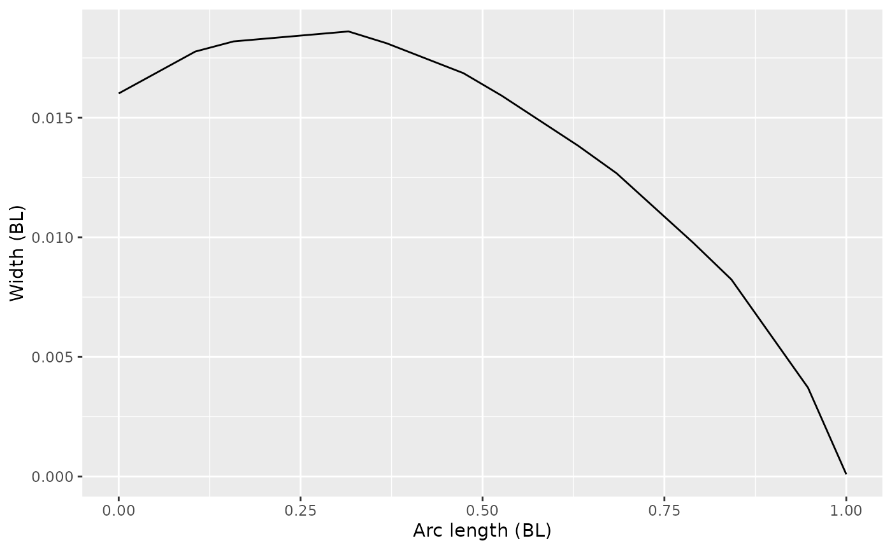

Here, we interpolated the width from the separate data frame so that
it’s defined at the right arc lengths for our lamprey data set.
`interpolate_width` assumes that `arclen` is in real units (like cm) and
goes from the head to the tip of the tail, so that the last value
represents the total length of the fish. Once the width is interpolated
at the new arc lengths, it also multiplies the width by the total fish
length.

``` r
lampreydata <-
  lampreydata |> 
  group_by(frame) |> 
  mutate(width = interpolate_width(fishwidth$s, fishwidth$ammowidth, arclen))
```

We just added another column to `lampreydata` containing the width at
each arclength along the body, defined in mm because the arc length is
in mm.

``` r
lampreydata |> 
  dplyr::filter(frame == 10)
#> # A tibble: 20 × 10
#> # Groups:   frame [1]
#>        t frame point  mxmm  mymm arclen0 arclen mxmm_s mymm_s  width
#>    <dbl> <int> <int> <dbl> <dbl>   <dbl>  <dbl>  <dbl>  <dbl>  <dbl>
#>  1   0.2    10     1  381.  133.    0      0      381.   133. 2.48  
#>  2   0.2    10     2  389.  134.    7.78   8.13   389.   135. 2.61  
#>  3   0.2    10     3  396.  136.   15.6   16.3    397.   136. 2.75  
#>  4   0.2    10     4  404.  137.   23.4   24.4    405.   137. 2.81  
#>  5   0.2    10     5  412.  138.   31.1   32.5    413.   138. 2.83  
#>  6   0.2    10     6  420.  137.   38.9   40.7    421.   136. 2.85  
#>  7   0.2    10     7  427.  134.   46.7   48.8    429.   133. 2.88  
#>  8   0.2    10     8  434.  132.   54.5   56.9    437.   131. 2.80  
#>  9   0.2    10     9  442.  130.   62.3   65.1    445.   130. 2.70  
#> 10   0.2    10    10  450.  131.   70.1   73.2    453.   132. 2.61  
#> 11   0.2    10    11  457.  133.   77.8   81.3    460.   135. 2.46  
#> 12   0.2    10    12  464.  138.   85.6   89.5    467.   140. 2.30  
#> 13   0.2    10    13  470.  142.   93.4   97.6    473.   145. 2.14  
#> 14   0.2    10    14  476.  147.  101.   106.     480.   149. 1.96  
#> 15   0.2    10    15  483.  150.  109.   114.     488.   151. 1.74  
#> 16   0.2    10    16  491.  150.  117.   122.     496.   150. 1.51  
#> 17   0.2    10    17  499.  150.  125.   130.     504.   148. 1.27  
#> 18   0.2    10    18  506.  148.  132.   138.     512.   146. 0.923 
#> 19   0.2    10    19  514.  145.  140.   146.     520.   144. 0.574 
#> 20   0.2    10    20  521.  144.  148.   155.     528.   143. 0.0135
```

### Compute the center of mass

``` r
lampreydata <-
  lampreydata |> 
  ungroup() |> 
  get_midline_center_df(arclen, mxmm_s,mymm_s, width=width)
#> ℹ Estimating center of mass based on width

lampreydata |> 
  filter(frame %in% c(10, 20, 30, 40, 50)) |> 
  ggplot(aes(x = mxmm_s, y = mymm_s, color = frame)) +
  geom_path(aes(group = frame)) +
  geom_point(data = ~filter(.x, point == 1), aes(x = xcom, y = ycom)) +
  coord_fixed()
```

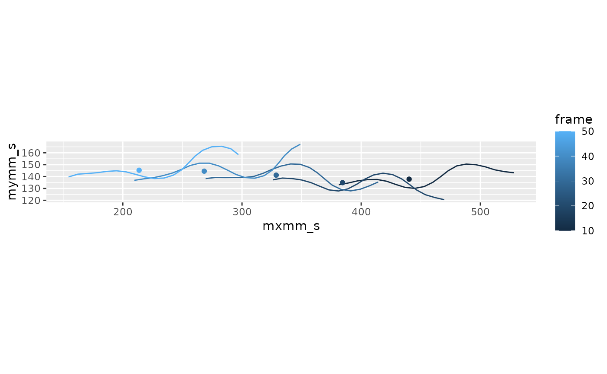

### Compute curvature

This computes the curvature by the two different methods.

``` r
lampreydata <-
  lampreydata |> 
  group_by(frame) |> 
  mutate(curve_ang = curvature(arclen0, mxmm_s, mymm_s),
         curve_xy = curvature(arclen0, mxmm_s, mymm_s, method="xy"))
```

Compare the results. Here they aren’t very different, although the “xy”
method gives very slightly higher peaks.

``` r
lampreydata |> 
  filter(frame %in% c(10, 20)) |> 
  mutate(frame = factor(frame)) |> 
  ggplot(aes(x = arclen0, color = frame, group = frame)) +
  geom_path(aes(y = curve_ang), linetype='solid') +
  geom_path(aes(y = curve_xy), linetype='dashed')
#> Warning: Removed 4 rows containing missing values or values outside the scale range
#> (`geom_path()`).
#> Removed 4 rows containing missing values or values outside the scale range
#> (`geom_path()`).
```

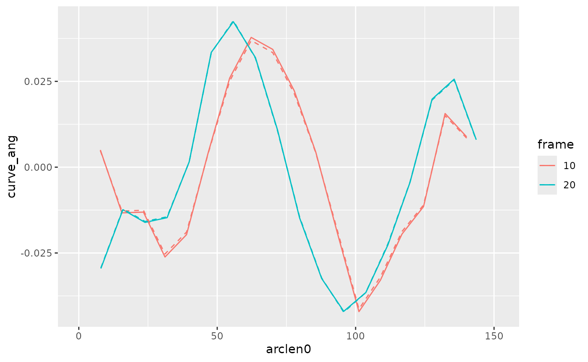 Plot curvature
as a function of time for two different points along the body. For the
Hilbert analysis to work well, these should be close to sinusoidal and
centered around 0.

``` r
lampreydata |> 
  filter(point %in% c(10, 18)) |>
  mutate(point = factor(point)) |> 
  ggplot(aes(x = t, y = curve_ang, color = point)) +
  geom_path()
#> Warning: Removed 4 rows containing missing values or values outside the scale range
#> (`geom_path()`).
```


### Get excursion

This extracts the central swimming axis.

``` r
lampreydata <- lampreydata |> 
  ungroup() |> 
  mutate(mxmm_ctr = mxmm_s - xcom,
         mymm_ctr = mymm_s - ycom) |> 
  get_primary_swimming_axis_df(t, mxmm_ctr, mymm_ctr, .frame=frame)
```

``` r
lampreydata |> 
  filter(frame %in% c(10, 20, 30)) |> 
  ggplot(aes(x = mxmm, y = mymm, color = frame)) +
  geom_path(aes(group = frame)) +
  geom_segment(data = ~ filter(.x, point == 20), 
               aes(x = xcom, y = ycom, 
                   xend = xcom - 50*swimaxis_x, 
                   yend = ycom - 50*swimaxis_y)) +
  geom_point(data = ~ filter(.x, point == 20), 
               aes(x = xcom, y = ycom), color = 'red') +
  facet_grid(frame ~ .) +
  coord_fixed()
```

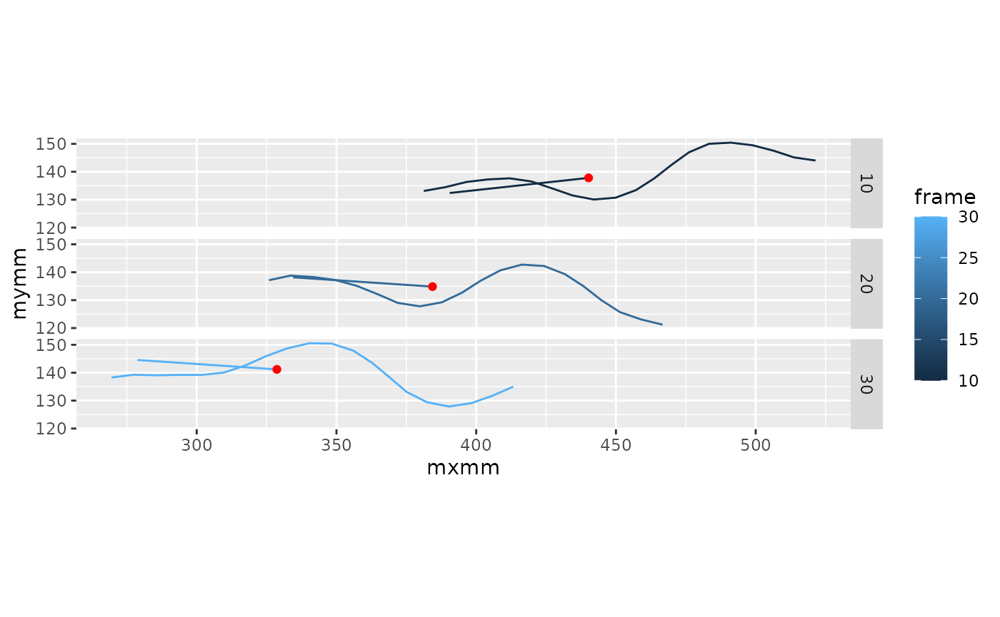

Similar to curvature, we can compute phases based on the lateral
excursions (`b`). As above, they need to be mostly sinusoidal and
centered around zero.

``` r
lampreydata |> 
  filter(point %in% c(10, 18)) |>
  mutate(point = factor(point)) |> 
  ggplot(aes(x = t, y = exc, color = point)) +
  geom_path()
#> Warning: Removed 4 rows containing missing values or values outside the scale range
#> (`geom_path()`).
```

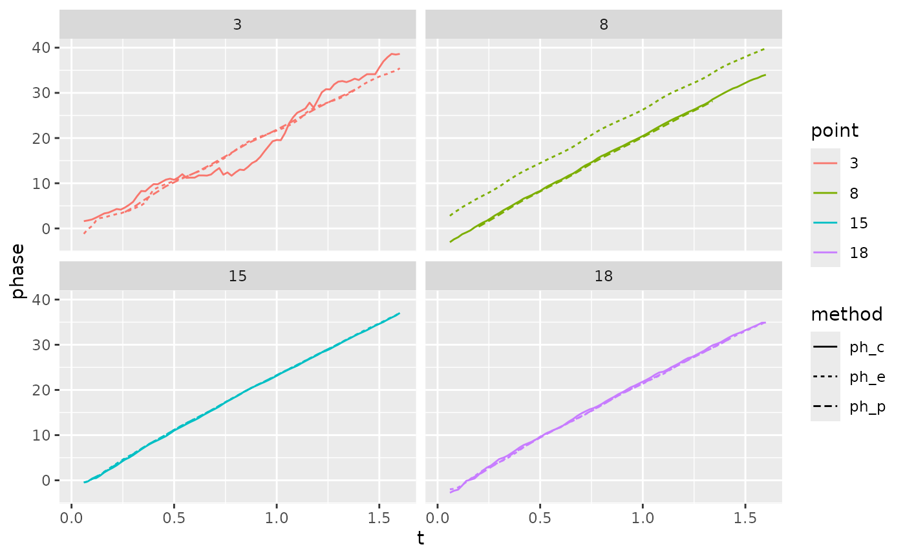

### Phase

#### Smooth the data again

To ensure that we have smooth enough data for the phase estimation, we
smooth the oscillations here again.

Get the sample frequency.

``` r
sampfreq <-
  lampreydata |> 
  filter(frame %in% c(1, 2)) |> 
  group_by(frame) |> 
  summarize(t = first(t)) |> 
  ungroup() |> 
  summarize(sampfreq = 1 / (t[2] - t[1])) |> 
  pull(sampfreq)

sampfreq
#> [1] 50
```

Build the filter. `build_filter` here is just a small wrapper function
for [`gsignal::butter`](https://rdrr.io/pkg/gsignal/man/butter.html),
which builds a Butterwoth filter and returns it in SoS format.

``` r
filt <- build_filter(0.5, 15, sampfreq = sampfreq)
```

Apply the filter for each point over time. Make sure that you are
smoothing each point individually (i.e., use `group_by(point)`) and that
the data are sorted in time.

``` r
lampreydata <-
  lampreydata |> 
  arrange(point, t) |> 
  group_by(point) |> 
  mutate(exc_s = apply_filter(filt, exc),
         curve_ang_s = apply_filter(filt, curve_ang))
```

``` r
lampreydata |> 
  filter(point %in% c(10, 18)) |>
  mutate(point = factor(point)) |> 
  ggplot(aes(x = t, color = point)) +
  geom_path(aes(y = exc)) +
  geom_path(aes(y = exc_s), linetype = 'dashed')
#> Warning: Removed 4 rows containing missing values or values outside the scale range
#> (`geom_path()`).
#> Removed 4 rows containing missing values or values outside the scale range
#> (`geom_path()`).
```

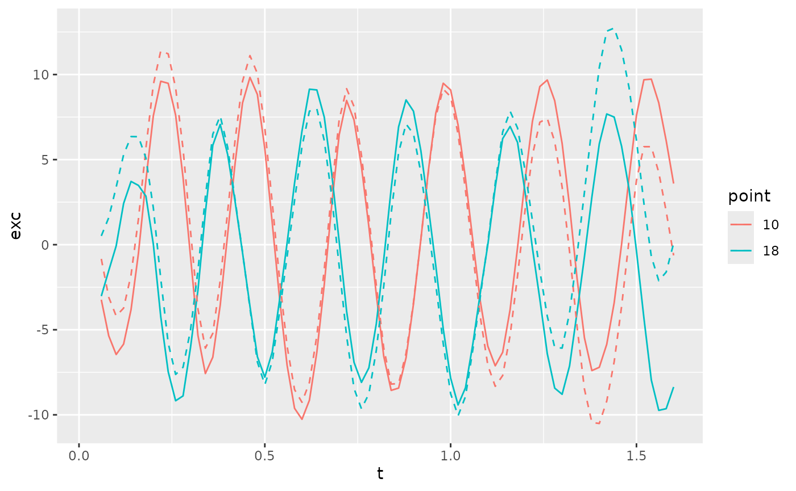

Now we compute the phase of each body point as it oscillates over time,
looking at either the curvature `curve_ang` or the excursion `b`.

``` r
lampreydata <-
  lampreydata |> 
  arrange(frame, desc(point)) |> 
  group_by(point) |> 
  mutate(ph_c = hilbert_phase(curve_ang_s),
         ph_e = hilbert_phase(exc_s),
         ph_p = peak_phase(exc_s))
#> Warning: There were 42 warnings in `mutate()`.
#> The first warning was:
#> ℹ In argument: `ph_c = hilbert_phase(curve_ang_s)`.
#> ℹ In group 2: `point = 2`.
#> Caused by warning in `hilbert_phase()`:
#> ! For a good phase estimate, the signal should oscillate around 0
#> ℹ Run `dplyr::last_dplyr_warnings()` to see the 41 remaining warnings.
```

`hilbert_phase` does a few checks on the results and gives warnings if
it finds things that might cause problems. \* It checks to make sure
that most of the input data is not NA. It does not give a warning if all
of the input data is NA, only if at least some of the data is not NA. \*
It checks that the input signal seems to oscillate around 0. \* It looks
whether the phase mostly advances over time. If we have cases when the
phase seems to run backwards, that’s often a good indication that the
data isn’t smoothed enough. In the case above, the warning is for point
2, which is close to the head, where curvature tends to be quite low, so
we can ignore the warning.

Compare the two phase estimates. We expect the slopes to be the same,
but there could be an offset of $2\pi$ in places. Here solid lines are
phase based on curvature and dashed are phase based on excursion.

``` r
lampreydata |> 
  ungroup() |> 
  filter(point %in% c(3, 8, 15, 18)) |> 
  mutate(point = factor(point)) |> 
  pivot_longer(cols = c(ph_c, ph_e, ph_p), names_to = "method", values_to = "phase") |> 
  ggplot(aes(x = t, y = phase, color = point, linetype = method)) +
  geom_path() + 
  facet_wrap(~point)
#> Warning: Removed 93 rows containing missing values or values outside the scale range
#> (`geom_path()`).
```

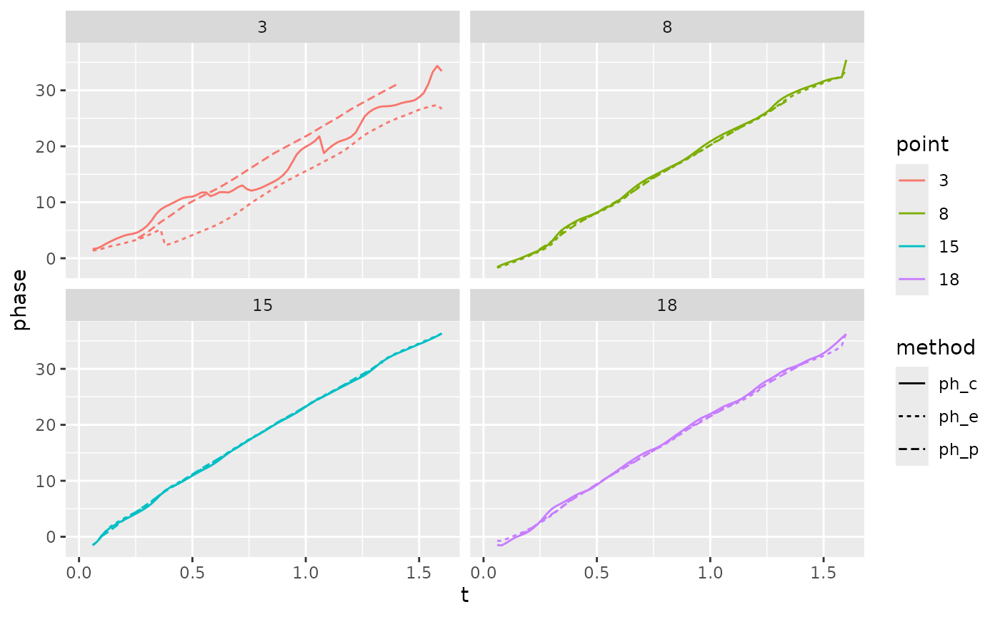 Note that the
curvature based phase (solid line) tends to fluctuate a lot for point 3,
which is near the head where curvature is small.

#### Example phase figure

``` r
examplet <- 1.2
colors <- c("#1f78b4", "black")

p1 <- lampreydata |> 
  ungroup() |> 
  filter(point %in% c(13, 15)) |> 
  mutate(point = factor(point)) |> 
  ggplot(aes(x = t, y = exc, color = point, linetype = point)) +
  geom_path(aes(group = point)) +
  geom_vline(xintercept = examplet) +
  scale_color_manual(values = colors) +
  theme_minimal() +
  xlim(c(1,1.5)) +
  labs(x = "Time (s)", y = "Excursion (mm)") +
  theme(legend.position="none",
        panel.grid.minor.x = element_blank(),
        panel.grid.minor.y = element_blank())

p2 <- lampreydata |> 
  ungroup() |> 
  filter(point %in% c(13, 15)) |> 
  mutate(point = factor(point),
         ph_e = (ph_e %% (2*pi)) / (2*pi)) |> 
  ggplot(aes(x = t, y = ph_e, color = point, linetype = point)) +
  geom_path(aes(group = point)) +
  geom_vline(xintercept = examplet) +
  scale_color_manual(values = colors) +
  xlim(c(1,1.5)) +
  ylim(0,1) +
  theme_minimal() +
  labs(x = "Time (s)", y = "Phase") +
  theme(legend.position="none",
        panel.grid.minor.x = element_blank(),
        panel.grid.minor.y = element_blank())

p3 <- lampreydata |> 
  ungroup() |> 
  mutate(point = factor(point)) |> 
  filter(near(t, examplet, tol = 0.001)) |> 
  ggplot(aes(y = exc, x = exc_x)) +
  geom_path() +
  geom_point(data = ~ filter(.x, point %in% c(13, 15)),
             aes(color = point, shape = point)) +
  scale_color_manual(values = colors) +
  scale_shape_manual(values = c(19, 5)) +
  coord_fixed() +
  theme_minimal() +
  theme(legend.position="none")

p4 <- lampreydata |> 
  ungroup() |> 
  mutate(point = factor(point)) |> 
  filter(near(t, examplet, tol = 0.001)) |> 
  mutate(ph_eu = (gsignal::unwrap(ph_e) / (2*pi)) %% 1) |> 
  ggplot(aes(y = ph_eu, x = arclen)) +
  geom_path() + #color = "#1b9e77") +
  geom_point(data = ~ filter(.x, point %in% c(13, 15)),
             aes(color = point, shape = point)) +
  scale_color_manual(values = colors) +
  scale_shape_manual(values = c(19, 5)) +
  ylim(0,1) +
  theme_minimal() +
  labs(x = "Arc length (mm)", y = "Phase") +
  theme(legend.position="none",
        panel.grid.minor.x = element_blank(),
        panel.grid.minor.y = element_blank())
  # scale_y_continuous(transform = "reverse") 

p1 + p3 + p2 + p4 +
  plot_layout(nrow = 2, heights = c(1,2))
#> Warning: Removed 108 rows containing missing values or values outside the scale range
#> (`geom_path()`).
#> Removed 108 rows containing missing values or values outside the scale range
#> (`geom_path()`).
```

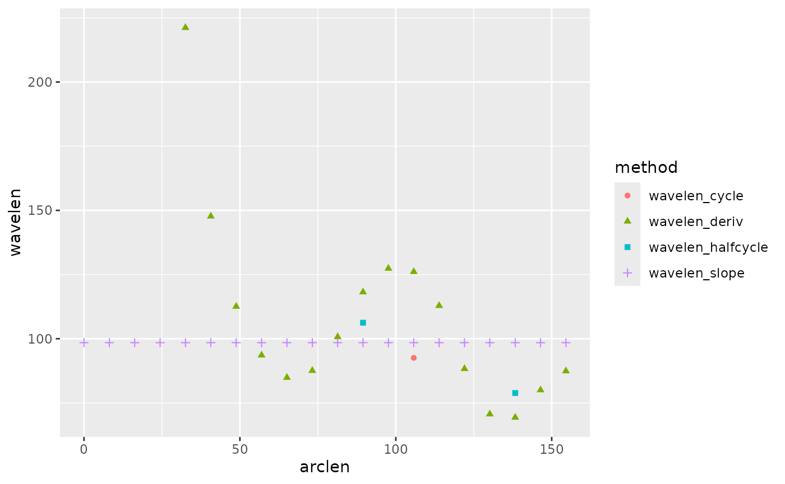

### Frequency

As described above, the time derivative of the phase is the frequency.
Here, we can compute a frequency at each point along the body, although
they ought to be the same.

``` r
lampreydata |> 
  group_by(point) |> 
  mutate(freq_c = get_frequency(t, ph_c, method='deriv'),
         freq_e = get_frequency(t, ph_e, method='deriv'),
         freq_p = get_frequency(t, ph_p, method='deriv')) |> 
  pivot_longer(cols = c(freq_c, freq_e, freq_p), names_to = "method", values_to = "freq") |> 
  filter(point %in% c(3, 15, 18)) |> 
  mutate(point = factor(point)) |> 
  ggplot(aes(x = t, y = freq, color = point, shape = method)) +
  scale_shape_manual(values = c(1, 17, 22)) +
  geom_point() +
  facet_wrap(~point)
#> Warning: There were 4 warnings in `mutate()`.
#> The first warning was:
#> ℹ In argument: `freq_c = get_frequency(t, ph_c, method = "deriv")`.
#> ℹ In group 2: `point = 2`.
#> Caused by warning in `get_frequency()`:
#> ! Phase seems to go backwards a lot, which may indicate an overly noisy signal
#> ℹ Run `dplyr::last_dplyr_warnings()` to see the 3 remaining warnings.
#> Warning: Removed 79 rows containing missing values or values outside the scale range
#> (`geom_point()`).
```

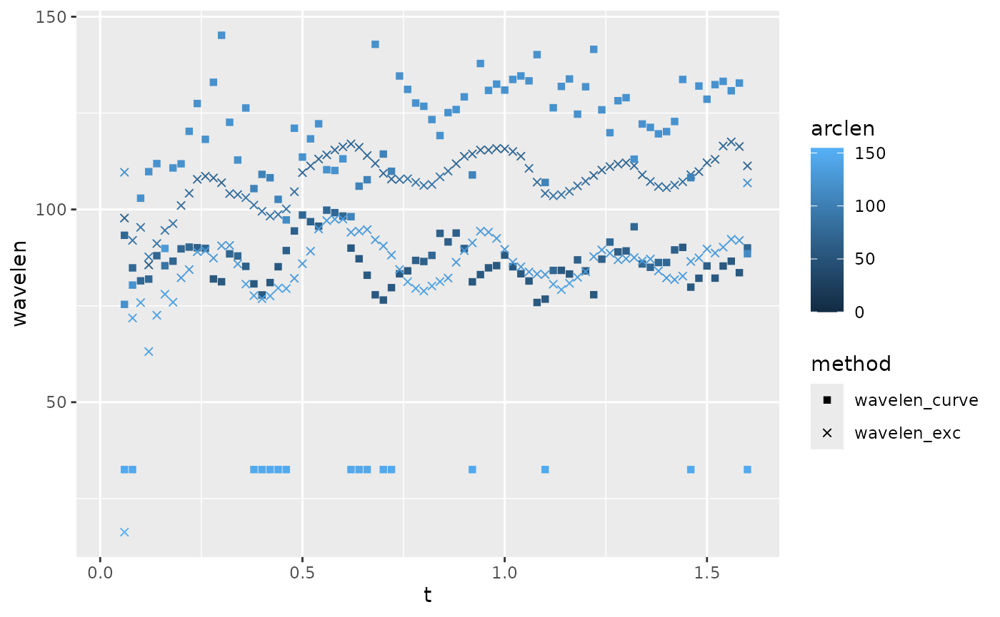 \# Body
wavelength

Body wavelength, as described above, is the derivative of the phase of
each point along the body with respect to arc length. Phase typically
decreases along the body, which indicates a backward traveling wave.

``` r
lampreydata |> 
  filter(frame %in% c(60, 80)) |> 
  group_by(frame) |> 
  mutate(phbody = ph_p) |>
  ggplot(aes(x = arclen, y = phbody, color = frame)) +
  geom_path(aes(group = frame))
#> Warning: Removed 20 rows containing missing values or values outside the scale range
#> (`geom_path()`).
```

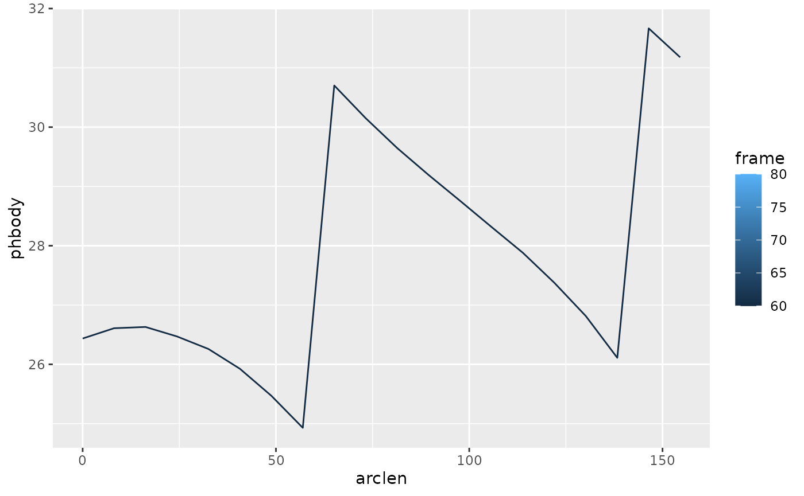 The apparent
discontinuity at $s$ = 50mm is not real. It just reflects the fact that
phase goes from $0$ to $2\pi$ and then wraps around back to 0. We get
rid of that by using the `unwrap` function, applied across the spatial
dimension (equivalently, using `group_by` with time or frame number).

This is the phase across the body with the discontinuities removed.

``` r
lampreydata |> 
  filter(frame %in% c(50, 60)) |> 
  group_by(frame) |> 
  mutate(phbody = gsignal::unwrap(ph_e)) |>
  ggplot(aes(x = arclen, y = phbody, color = frame)) +
  geom_path(aes(group = frame))
```

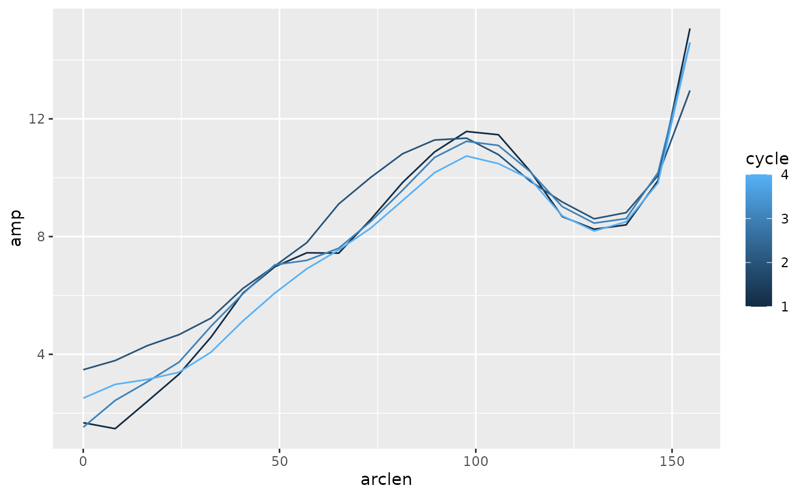

### Methods of estimating wavelength

There are several ways to estimate body wavelength based on the body
phase, which have different advantages and disadvantages. The function
`get_wavelength` can run each of them.

1.  At each point along the body, you can estimate the derivative of the
    phase with respect to arc length. This gives the most comprehensive
    results, and, in particular, makes it fairly simple to consider
    whether wavelength varies along the body, but is also very sensitive
    to noise.

2.  You can fit a line to all of the data along the body and take the
    slope of that line. This method is the least sensitive to noise, but
    only gives a single value along the entire body.

3.  You can look for the distance along the body in which the phase
    changes by a full or a half cycle. If you look for the phase at the
    tail and then step backward along the body until you find a point
    that’s either a full or half cycle before the tail, then that
    distance represents a full or half wave, respectively.
    `get_wavelength` makes this process more accurate by using a simple
    linear interpolation to find the distance that represents exactly 1
    or 0.5 waves.

The phase tends to be poorly estimated for body points that are more
anterior. `get_wavelength` allows you to specify a formula to ignore
certain locations for the estimate.

Here is an example for a single frame. We’re ignoring points that are
less than 30mm from the head.

``` r
w <-
  lampreydata |> 
  arrange(frame, arclen) |> 
  filter(frame %in% c(40)) |> 
  group_by(frame) |> 
  mutate(ph2 = gsignal::unwrap(ph_e),
         wavelen_deriv = get_wavelength(arclen, ph2, method="deriv",
                                   ignore_arclen_vals = \(s) s < 30),
         wavelen_slope = get_wavelength(arclen, ph2, method="slope",
                                   ignore_arclen_vals = \(s) s < 30),
         wavelen_cycle = get_wavelength(arclen, ph2, method="cycle",
                                   ignore_arclen_vals = \(s) s < 30,
                                   sort_arclen = FALSE),
         wavelen_halfcycle = get_wavelength(arclen, ph2, method="halfcycle",
                                   ignore_arclen_vals = \(s) s < 30,
                                   sort_arclen = TRUE))
w |> 
  pivot_longer(cols = contains("wavelen"), names_to = "method", values_to = "wavelen") |> 
  ggplot(aes(x = arclen, y = wavelen, color = method, shape = method)) +
  geom_point()
#> Warning: Removed 41 rows containing missing values or values outside the scale range
#> (`geom_point()`).
```

 Here, you can
see that all of the methods give similar results, but there are
different numbers of values and different resolution along the body. We
suggest the “halfcycle” option as a good, relatively robust compromise.

``` r
lampreydata |> 
  arrange(frame, arclen) |> 
  group_by(frame) |> 
  mutate(phbody_e = gsignal::unwrap(ph_e),
         phbody_c = gsignal::unwrap(ph_c),
         wavelen_exc = get_wavelength(arclen, phbody_e, method="halfcycle",
                                    ignore_arclen_vals = \(s) s < 30),
         wavelen_curve = get_wavelength(arclen, phbody_c, method="halfcycle",
                                    ignore_arclen_vals = \(s) s < 30)) |> 
  pivot_longer(cols = contains("wavelen"), names_to = "method", values_to = "wavelen") |> 
  ggplot(aes(x = t)) +
  geom_point(aes(y = wavelen, color = arclen, shape=method)) +
  scale_shape_manual(values = c(15, 4))
#> Warning: There were 6 warnings in `mutate()`.
#> The first warning was:
#> ℹ In argument: `wavelen_exc = get_wavelength(...)`.
#> ℹ In group 3: `frame = 3`.
#> Caused by warning in `get_wavelength()`:
#> ! Phase does not seem to be decreasing along the body. Wavelength may be strange
#> ℹ Run `dplyr::last_dplyr_warnings()` to see the 5 remaining warnings.
#> Warning: Removed 2838 rows containing missing values or values outside the scale range
#> (`geom_point()`).
```

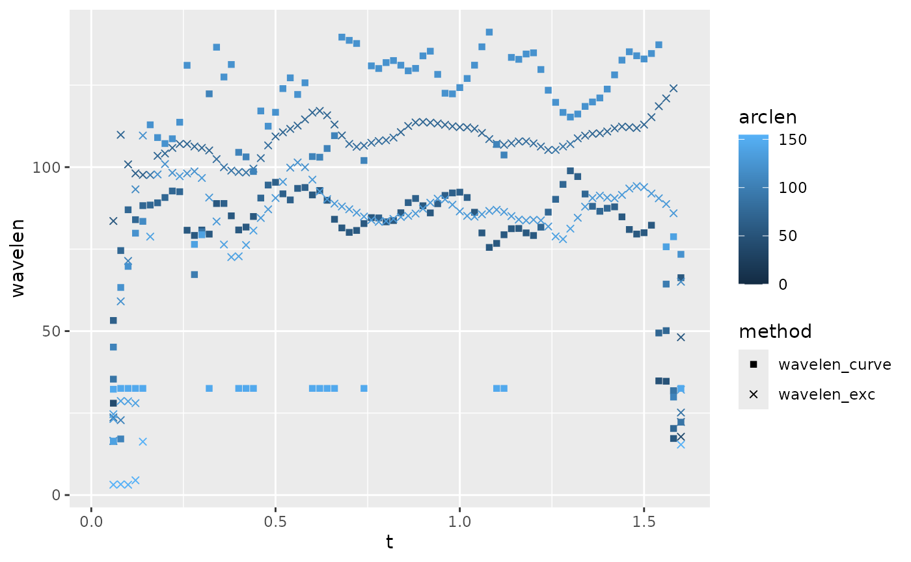 Here we see that
wavelength estimated based on curvature is slightly noisier than
curvature based on excursion, and that both fluctuate over time.

``` r
lampreydata |> 
  arrange(frame, arclen) |> 
  group_by(frame) |> 
  mutate(phbody_e = gsignal::unwrap(ph_e),
         phbody_c = gsignal::unwrap(ph_c),
         wavelen_exc = get_wavelength(arclen, phbody_e, method="halfcycle",
                                    ignore_arclen_vals = \(s) s < 30),
         wavelen_curve = get_wavelength(arclen, phbody_c, method="halfcycle",
                                    ignore_arclen_vals = \(s) s < 30)) |> 
  pivot_longer(cols = contains("wavelen"), names_to = "method", values_to = "wavelen") |> 
  ggplot(aes(x = arclen)) +
  geom_point(aes(y = wavelen, color = arclen, shape=method)) +
  scale_shape_manual(values = c(15, 4)) +
  facet_wrap(~method)
#> Warning: There were 6 warnings in `mutate()`.
#> The first warning was:
#> ℹ In argument: `wavelen_exc = get_wavelength(...)`.
#> ℹ In group 3: `frame = 3`.
#> Caused by warning in `get_wavelength()`:
#> ! Phase does not seem to be decreasing along the body. Wavelength may be strange
#> ℹ Run `dplyr::last_dplyr_warnings()` to see the 5 remaining warnings.
#> Warning: Removed 2838 rows containing missing values or values outside the scale range
#> (`geom_point()`).
```

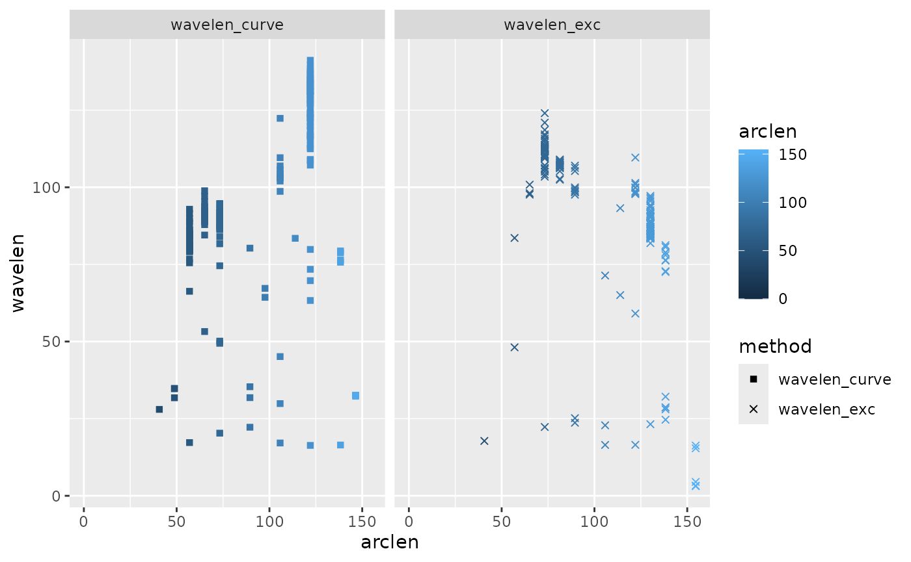 This plot shows
wavelength as a function of body position and estimation method. The
curvature-based wavelengths seem to increase along the body (aside from
some erroneous very low values very close to the tail), while the
excursion-based wavelengths tend to decrease moving toward the tail.

## Amplitude

To estimate amplitude, it’s helpful to set up an overall cycle number
for the whole body. We define this based on the excursion of the tail
point. `get_body_cycle_numbers` also excludes partial cycles.

``` r
lampreydata <-
  lampreydata |> 
  get_body_cycle_numbers_df(ph_p, 20) |> 
  arrange(t, point)

lampreydata
#> # A tibble: 1,600 × 27
#> # Groups:   point [20]
#>        t frame point  mxmm  mymm arclen0 arclen mxmm_s mymm_s width  xcom  ycom
#>    <dbl> <int> <int> <dbl> <dbl>   <dbl>  <dbl>  <dbl>  <dbl> <dbl> <dbl> <dbl>
#>  1  0.02     1     1    NA    NA      NA   0        NA     NA  2.48    NA    NA
#>  2  0.02     1     2    NA    NA      NA   8.13     NA     NA  2.61    NA    NA
#>  3  0.02     1     3    NA    NA      NA  16.3      NA     NA  2.75    NA    NA
#>  4  0.02     1     4    NA    NA      NA  24.4      NA     NA  2.81    NA    NA
#>  5  0.02     1     5    NA    NA      NA  32.5      NA     NA  2.83    NA    NA
#>  6  0.02     1     6    NA    NA      NA  40.7      NA     NA  2.85    NA    NA
#>  7  0.02     1     7    NA    NA      NA  48.8      NA     NA  2.88    NA    NA
#>  8  0.02     1     8    NA    NA      NA  56.9      NA     NA  2.80    NA    NA
#>  9  0.02     1     9    NA    NA      NA  65.1      NA     NA  2.70    NA    NA
#> 10  0.02     1    10    NA    NA      NA  73.2      NA     NA  2.61    NA    NA
#> # ℹ 1,590 more rows
#> # ℹ 15 more variables: nsum <int>, curve_ang <dbl>, curve_xy <dbl>,
#> #   mxmm_ctr <dbl>, mymm_ctr <dbl>, swimaxis_x <dbl>, swimaxis_y <dbl>,
#> #   exc_x <dbl>, exc <dbl>, exc_s <dbl>, curve_ang_s <dbl>, ph_c <dbl>,
#> #   ph_e <dbl>, ph_p <dbl>, cycle <dbl>
```

Now, we can use `group_by` on cycles to find cycle-by-cycle values.
Here, we look for the range of the excursion variable `b`. Half of that
range is the amplitude, which we can define at each point on the body,
and over the four cycles that are present in this trial.

``` r
lampreydata |> 
  group_by(point, cycle) |> 
  summarize(amp = (max(exc) - min(exc)) / 2,
            arclen = mean(arclen)) |> 
  ggplot(aes(x = arclen, y = amp, color = cycle)) +
  geom_path(aes(group = cycle))
#> `summarise()` has regrouped the output.
#> ℹ Summaries were computed grouped by point and cycle.
#> ℹ Output is grouped by point.
#> ℹ Use `summarise(.groups = "drop_last")` to silence this message.
#> ℹ Use `summarise(.by = c(point, cycle))` for per-operation grouping
#>   (`?dplyr::dplyr_by`) instead.
#> Warning: Removed 20 rows containing missing values or values outside the scale range
#> (`geom_path()`).
```

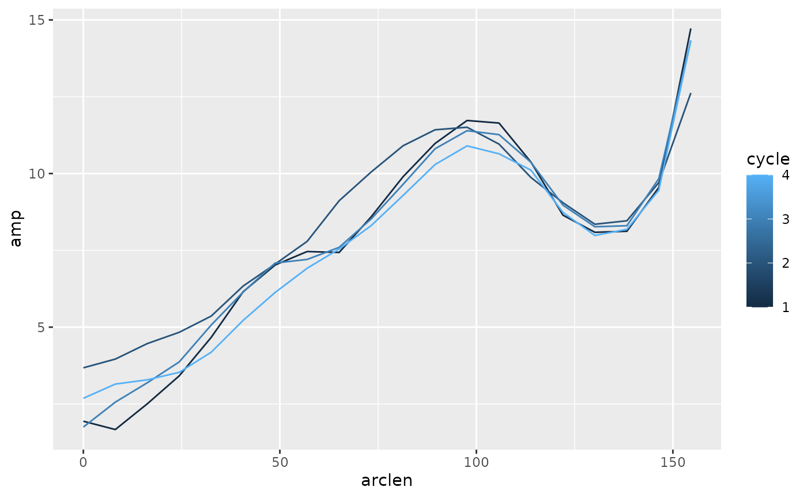
