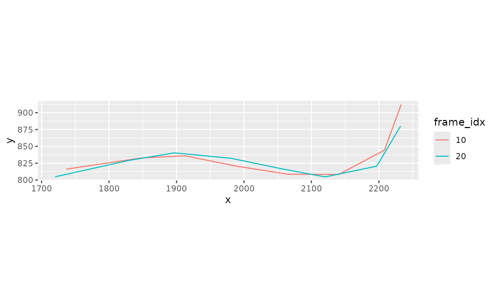
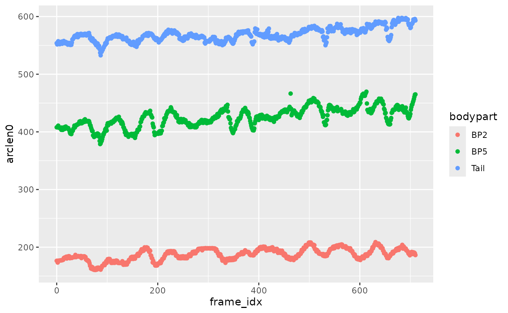
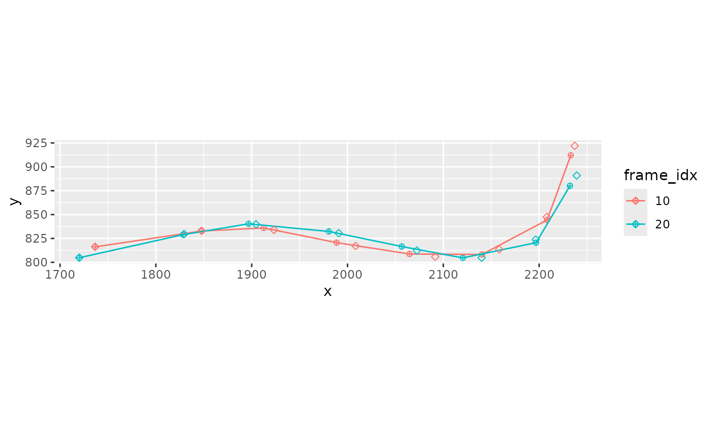
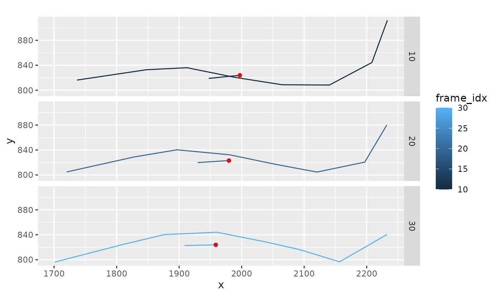

# prickleback_swimming

``` r
library(fishmechr)
#> 
#> Attaching package: 'fishmechr'
#> The following object is masked from 'package:stats':
#> 
#>     deriv
library(ggplot2)
library(tidyr)
library(dplyr)
#> 
#> Attaching package: 'dplyr'
#> The following objects are masked from 'package:stats':
#> 
#>     filter, lag
#> The following objects are masked from 'package:base':
#> 
#>     intersect, setdiff, setequal, union
```

This is an example of processing data from a swimming rock prickleback,
*Xiphister mucosus*.

The data was tracked using Sleap (<https://sleap.ai/>) and comes out in
the following format. `frame_idx` is the frame number, and each point
along the body is identified with the point name and `.x`, `.y`, the
coordinate, and `.score`, which is a measure of the estimated accuracy
of the point. All of the points together are also given a score
(`instance.score`).

``` r
head(xmucosusdata)
#> # A tibble: 6 × 27
#>   track frame_idx instance.score Snout.x Snout.y Snout.score BP1.x BP1.y
#>   <lgl>     <dbl>          <dbl>   <dbl>   <dbl>       <dbl> <dbl> <dbl>
#> 1 NA            0           6.08   1753.    821.       0.904 1864.  833.
#> 2 NA            1           6.07   1752.    821.       0.922 1861.  833.
#> 3 NA            2           6.07   1752.    821.       0.919 1860.  833.
#> 4 NA            3           6.06   1749.    821.       0.928 1857.  833.
#> 5 NA            4           6.09   1748.    821.       0.926 1857.  833.
#> 6 NA            5           6.01   1745.    820.       0.903 1856.  833.
#> # ℹ 19 more variables: BP1.score <dbl>, BP2.x <dbl>, BP2.y <dbl>,
#> #   BP2.score <dbl>, BP3.x <dbl>, BP3.y <dbl>, BP3.score <dbl>, BP4.x <dbl>,
#> #   BP4.y <dbl>, BP4.score <dbl>, BP5.x <dbl>, BP5.y <dbl>, BP5.score <dbl>,
#> #   BP6.x <dbl>, BP6.y <dbl>, BP6.score <dbl>, Tail.x <dbl>, Tail.y <dbl>,
#> #   Tail.score <dbl>
```

## Rearrange the data

We need to rearrange the data into “long” form, where the point names
are in a separate column, and we have single columns for the `x`, `y`,
and `score` values. The function `pivot_kinematics_longer` is a
convenience wrapper for
[`tidyr::pivot_longer`](https://tidyr.tidyverse.org/reference/pivot_longer.html)
that understands the format of points from Sleap or DeepLabCut.

You need to pass in the names of your points (in order from head to
tail) and the name of the column you want to put the point names in.

``` r
pointnames <- c("Snout", "BP1", "BP2", "BP3", "BP4", "BP5", "BP6", "Tail")
xmucosusdata <- xmucosusdata |> 
  pivot_kinematics_longer(pointnames = pointnames,
                          point_to = "bodypart")
```

``` r
head(xmucosusdata)
#> # A tibble: 6 × 7
#>   track frame_idx instance.score bodypart     x     y score
#>   <lgl>     <dbl>          <dbl> <fct>    <dbl> <dbl> <dbl>
#> 1 NA            0           6.08 Snout    1753.  821. 0.904
#> 2 NA            0           6.08 BP1      1864.  833. 0.797
#> 3 NA            0           6.08 BP2      1928.  828. 0.677
#> 4 NA            0           6.08 BP3      2001.  813. 0.768
#> 5 NA            0           6.08 BP4      2081.  804. 0.603
#> 6 NA            0           6.08 BP5      2157.  816. 0.633
```

## Process the data

From here on out, the steps to process the data are quite similar to
what is shown in the main vignette.

``` r
xmucosusdata |> 
  filter(frame_idx %in% c(10, 20)) |> 
  mutate(frame_idx = factor(frame_idx)) |> 
  ggplot(aes(x = x, y = y, color = frame_idx, group = frame_idx)) +
  geom_path() +
  coord_fixed()
```



### Get arc length

``` r
xmucosusdata <-
  xmucosusdata |> 
  group_by(frame_idx) |> 
  mutate(arclen0 = arclength(x, y))
```

``` r
xmucosusdata |> 
  ungroup() |> 
  filter(bodypart %in% c("BP2", "BP5", "Tail")) |> 
  ggplot(aes(x = frame_idx, y = arclen0, color = bodypart)) +
  geom_point()
```



### Interpolate to constant arc length

``` r
xmucosusdata <- xmucosusdata |> 
  interpolate_points_df(arclen0, x, y, spar = 0.2,
                        tailmethod = 'extrapolate',
                        .frame = frame_idx,
                        .point = bodypart,
                        .out = c(arclen='arclen', xs='x_s', ys='y_s'))
```

``` r
xmucosusdata |> 
  filter(frame_idx %in% c(10, 20)) |> 
  mutate(frame_idx = factor(frame_idx)) |> 
  ggplot(aes(x = x, y, color = frame_idx, group = frame_idx)) +
  geom_point(shape = 10) +
  geom_path() +
  geom_point(aes(x = x_s, y = y_s), shape = 5) +
  coord_fixed()
```



### Interpolate the width

``` r
xmucosusdata <-
  xmucosusdata |> 
  group_by(frame_idx) |> 
  mutate(width = interpolate_width(fishwidth$s, fishwidth$eelwidth, arclen))
```

### Get the center

``` r
xmucosusdata <-
  xmucosusdata |> 
  ungroup() |> 
  get_midline_center_df(arclen, x_s,y_s, width=width,
                        .frame = frame_idx)
#> ℹ Estimating center of mass based on width
```

### Get the swimming axis

``` r
xmucosusdata <-
  xmucosusdata |> 
  mutate(x_ctr = x_s - xcom,
         y_ctr = y_s - ycom,
         t = frame_idx / 60) |> 
  get_primary_swimming_axis_df(t, x_ctr,y_ctr,
                               .frame = frame_idx,
                               .point = bodypart)
```

``` r
xmucosusdata |> 
  filter(frame_idx %in% c(10, 20, 30)) |> 
  ggplot(aes(x = x, y = y, color = frame_idx)) +
  geom_path(aes(group = frame_idx)) +
  geom_segment(data = ~ filter(.x, bodypart == "Tail"), 
               aes(x = xcom, y = ycom, 
                   xend = xcom - 50*swimaxis_x, 
                   yend = ycom - 50*swimaxis_y)) +
  geom_point(data = ~ filter(.x, bodypart == "Tail"), 
               aes(x = xcom, y = ycom), color = 'red') +
  facet_grid(frame_idx ~ .) +
  coord_fixed()
```


