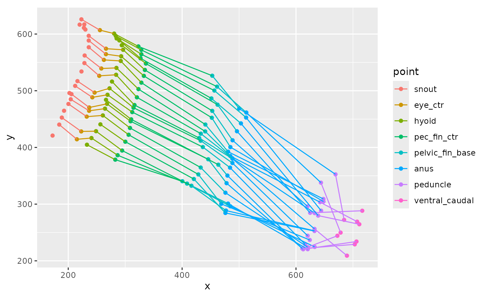
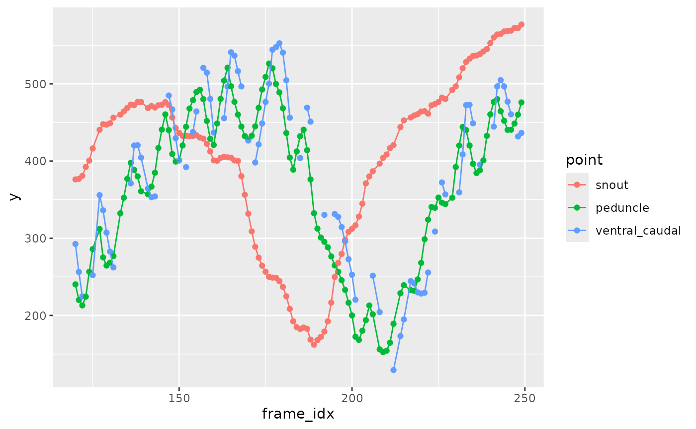
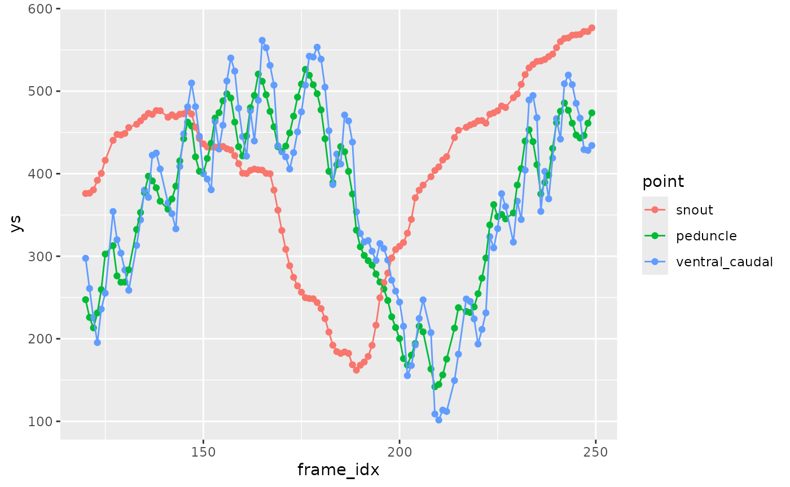
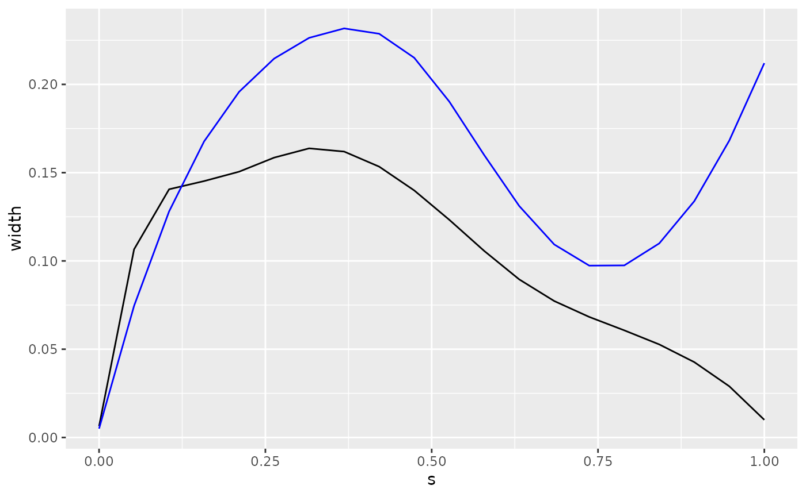
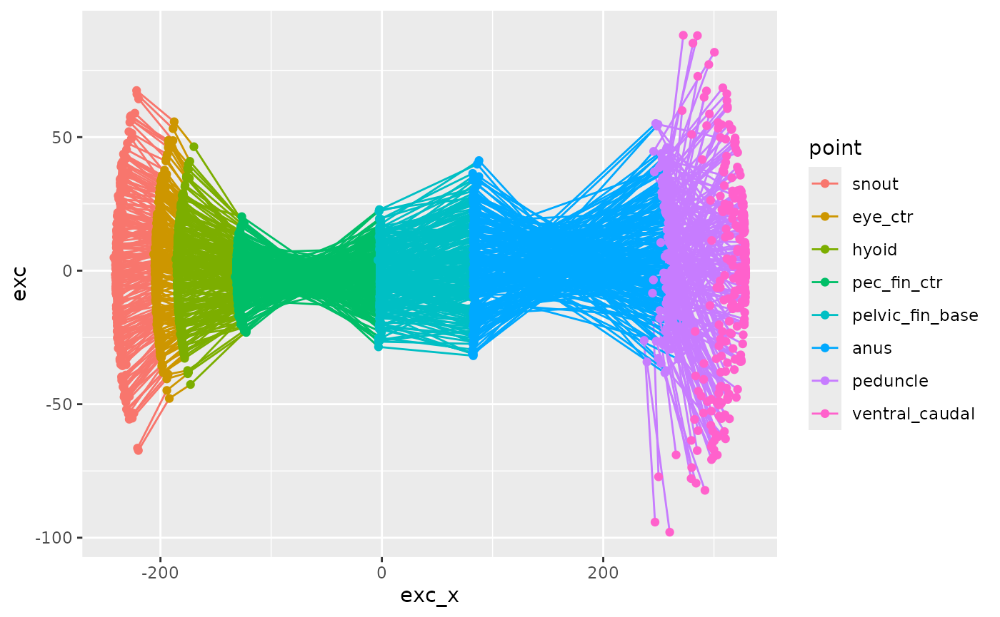
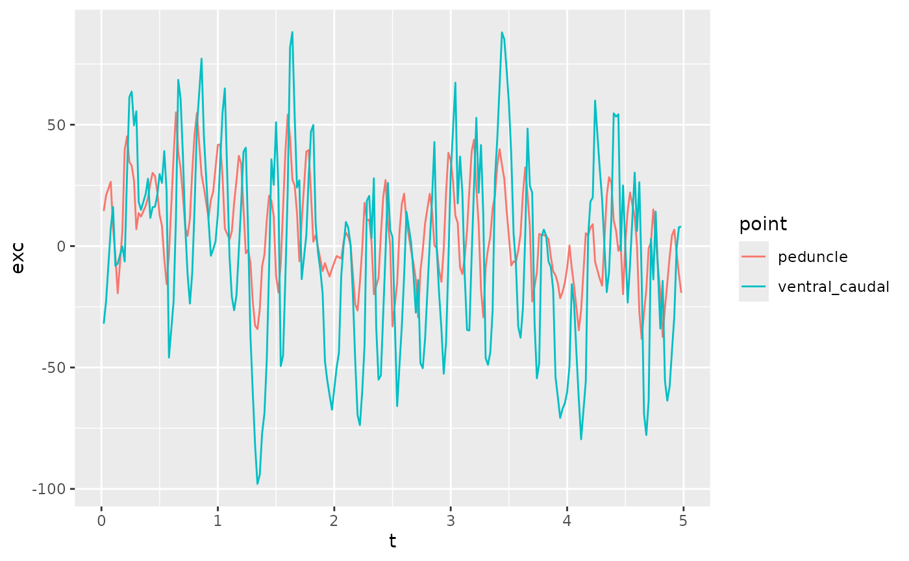
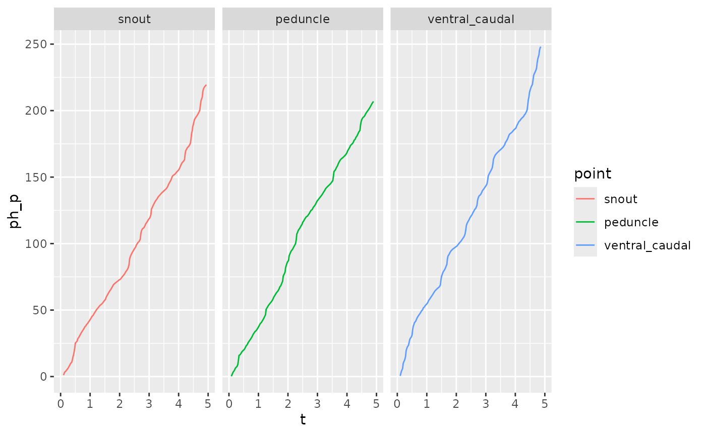
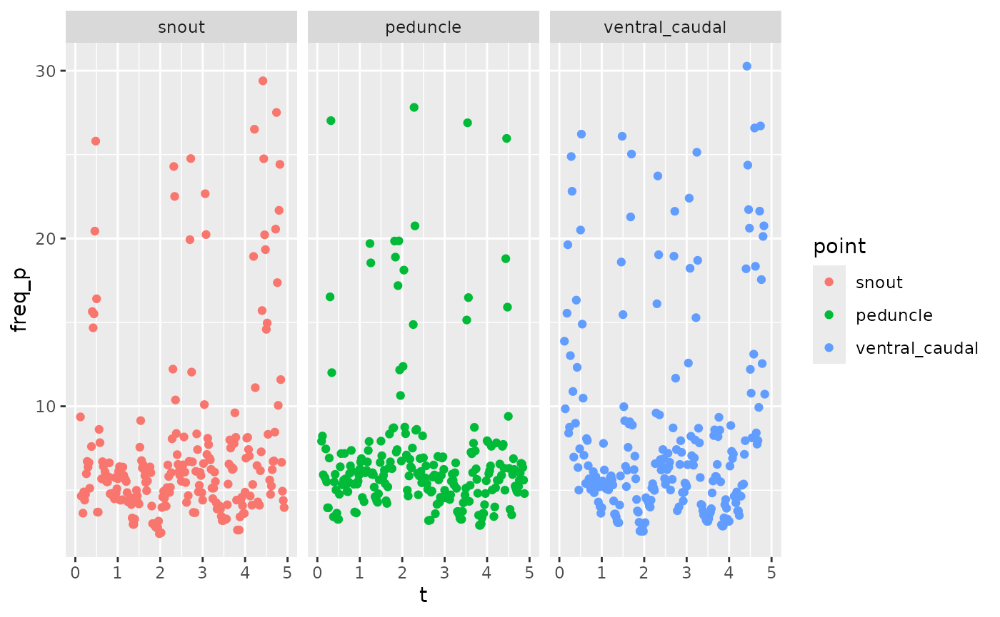
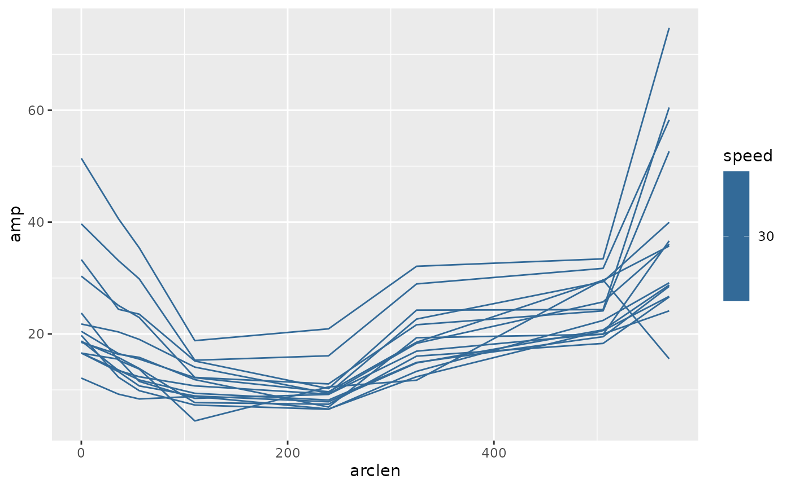
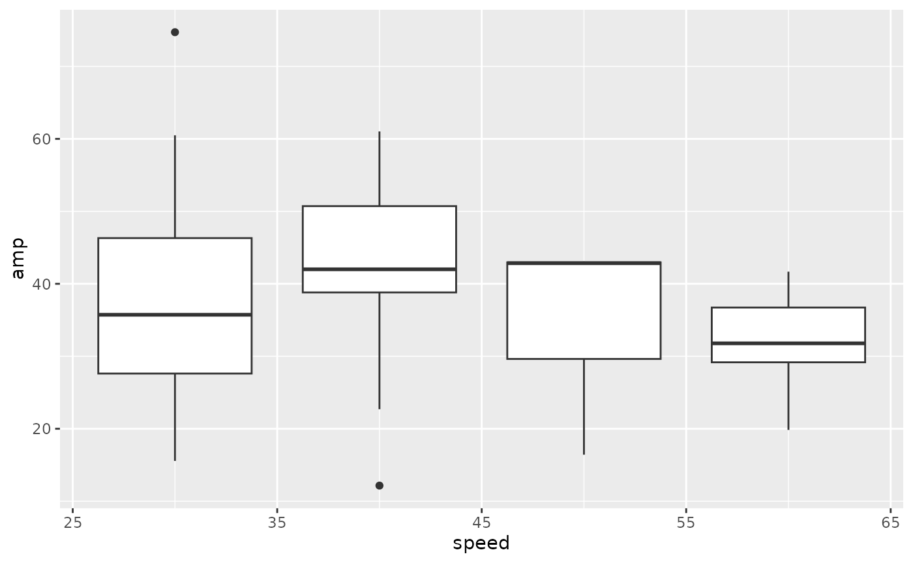

# process_sleap_data

``` r
library(fishmechr)
#> 
#> Attaching package: 'fishmechr'
#> The following object is masked from 'package:stats':
#> 
#>     deriv
library(ggplot2)
library(tidyr)
library(dplyr)
#> 
#> Attaching package: 'dplyr'
#> The following objects are masked from 'package:stats':
#> 
#>     filter, lag
#> The following objects are masked from 'package:base':
#> 
#>     intersect, setdiff, setequal, union
```

``` r
library(cli)
options(cli.progress_show_after = 0)
options(cli.progress_clear = FALSE)
```

These are your SLEAP output data files. This is example code that you
could use. For the vignette, these data files are included in the
package.

``` r
library(here)

sleapfiles <- c(
  here("data-raw","2024-11-14_labels2.000_fish_01-030RPM-ortho-2024-11-14T044441.analysis.csv"),
  here("data-raw","2024-11-14_labels2.001_fish_01-040RPM-ortho-2024-11-14T044525.analysis.csv"),
  here("data-raw", "2024-11-14_labels2.002_fish_01-050RPM-ortho-2024-11-14T045204.analysis.csv"),
  here("data-raw","2024-11-14_labels2.003_fish_01-060RPM-ortho-2024-11-14T044754.analysis.csv"),
  here("data-raw","2024-11-14_labels2.004_fish_01-070RPM-ortho-2024-11-14T044858.analysis.csv")
)

parse_file_name <- function(fn)
{
  d <- stringr::str_match(fn, 
                 "_(?<id>\\w+_\\d+)-(?<speed>\\d+)RPM.+(?<datetime>\\d{4}-\\d{2}-\\d{2}T\\d{6})")
  
  tibble::as_tibble_row(d[1, 2:4], .name_repair = "minimal")
}

zfishdata <- purrr::map(sleapfiles, \(fn) readr::read_csv(fn, id = "fn", 
                                         show_col_types = FALSE)) |> 
  bind_rows() |> 
  mutate(dd = purrr::map(fn, parse_file_name)) |> 
  unnest(dd) |> 
  mutate(fn = basename(fn),
         speed = as.numeric(speed)) 

zfish_goodframes <- readr::read_csv(here("data-raw", "zfish_goodframes.csv"))
```

``` r
head(zfishdata)
#> # A tibble: 6 × 46
#>   fn        track frame_idx instance.score left_pec_fin_tip.x left_pec_fin_tip.y
#>   <chr>     <lgl>     <dbl>          <dbl>              <dbl>              <dbl>
#> 1 2024-11-… NA            0          NA                  315.               185.
#> 2 2024-11-… NA            1          NA                  315.               180.
#> 3 2024-11-… NA            2           9.99               317.               176.
#> 4 2024-11-… NA            3          NA                  315.               169.
#> 5 2024-11-… NA            4          NA                   NA                 NA 
#> 6 2024-11-… NA            5           9.84                NA                 NA 
#> # ℹ 40 more variables: left_pec_fin_tip.score <dbl>, right_eye.x <dbl>,
#> #   right_eye.y <dbl>, right_eye.score <dbl>, left_eye.x <dbl>,
#> #   left_eye.y <dbl>, left_eye.score <dbl>, right_pec_fin_base.x <dbl>,
#> #   right_pec_fin_base.y <dbl>, right_pec_fin_base.score <dbl>, anus.x <dbl>,
#> #   anus.y <dbl>, anus.score <dbl>, hyoid.x <dbl>, hyoid.y <dbl>,
#> #   hyoid.score <dbl>, dorsal_caudal.x <dbl>, dorsal_caudal.y <dbl>,
#> #   dorsal_caudal.score <dbl>, peduncle.x <dbl>, peduncle.y <dbl>, …
head(zfish_goodframes)
#> # A tibble: 6 × 4
#>   File                                                         Start   End Block
#>   <chr>                                                        <dbl> <dbl> <dbl>
#> 1 2024-11-14_labels2.000_fish_01-030RPM-ortho-2024-11-14T0444…     1   250     1
#> 2 2024-11-14_labels2.001_fish_01-040RPM-ortho-2024-11-14T0445…     1   250     1
#> 3 2024-11-14_labels2.002_fish_01-050RPM-ortho-2024-11-14T0452…     1    71     1
#> 4 2024-11-14_labels2.002_fish_01-050RPM-ortho-2024-11-14T0452…   167   250     2
#> 5 2024-11-14_labels2.003_fish_01-060RPM-ortho-2024-11-14T0447…    48   135     1
#> 6 2024-11-14_labels2.003_fish_01-060RPM-ortho-2024-11-14T0447…   224   250     2
```

Frame rate from your cameras

``` r
fps <- 50
```

These are all our points, ordered from head to tail

``` r
pointnames <- c("snout", "eye_ctr", "left_eye", "right_eye", "hyoid",   
                "pec_fin_ctr", "left_pec_fin_base", "left_pec_fin_tip", 
                "right_pec_fin_base", "right_pec_fin_tip", "pelvic_fin_base",
                "anus", "peduncle", "ventral_caudal", "dorsal_caudal")
```

``` r
zfdata_ctr <-
  zfishdata |>  
  mutate(eye_ctr.x = (left_eye.x + right_eye.x)/2,
         eye_ctr.y = (left_eye.y + right_eye.y)/2,
         eye_ctr.score = NA,
         pec_fin_ctr.x = (left_pec_fin_base.x + right_pec_fin_base.x)/2,
         pec_fin_ctr.y = (left_pec_fin_base.y + right_pec_fin_base.y)/2,
         pec_fin_ctr.score = NA
         )
```

``` r
zfdata_ctr <- zfdata_ctr |> 
  relocate(id, speed, datetime) |> 
  pivot_kinematics_longer(pointnames = pointnames)
```

``` r
head(zfdata_ctr)
#> # A tibble: 6 × 11
#>   id      speed datetime  fn    track frame_idx instance.score point     x     y
#>   <chr>   <dbl> <chr>     <chr> <lgl>     <dbl>          <dbl> <fct> <dbl> <dbl>
#> 1 fish_01    30 2024-11-… 2024… NA            0             NA snout  144.  189.
#> 2 fish_01    30 2024-11-… 2024… NA            0             NA eye_…  173.  209.
#> 3 fish_01    30 2024-11-… 2024… NA            0             NA left…  188.  181.
#> 4 fish_01    30 2024-11-… 2024… NA            0             NA righ…  157.  237.
#> 5 fish_01    30 2024-11-… 2024… NA            0             NA hyoid  176.  221.
#> 6 fish_01    30 2024-11-… 2024… NA            0             NA pec_…  233.  238.
#> # ℹ 1 more variable: score <dbl>
```

Now pull out just the good frames based on our other data table

``` r
zfdata_good <- list()
for (i in seq(1, nrow(zfish_goodframes))) {
  good1 <- zfdata_ctr |> 
    filter(fn == zfish_goodframes$File[[i]],
           between(frame_idx, zfish_goodframes$Start[[i]], zfish_goodframes$End[[i]])) |> 
    mutate(block = zfish_goodframes$Block[[i]])
  zfdata_good[[i]] <- good1
}
zfdata_good <- bind_rows(zfdata_good)
```

This shows the x and y positions of several of the points in multiple
frames.

``` r
zfdata_good |> 
  arrange(speed, frame_idx, point) |> 
  filter(speed == 30,
         between(frame_idx, 120, 140)) |> 
  filter(point %in% c("snout", "hyoid", "eye_ctr", "pec_fin_ctr", 
                      "pelvic_fin_base", "anus", "peduncle", "ventral_caudal")) |> 
  ggplot(aes(x = x, y = y, color = point)) +
  geom_point() +
  geom_path(aes(group = frame_idx)) +
  coord_fixed()
#> Warning: Removed 20 rows containing missing values or values outside the scale range
#> (`geom_point()`).
#> Warning: Removed 12 rows containing missing values or values outside the scale range
#> (`geom_path()`).
```



This shows just the y coordinate against frame number.

``` r
zfdata_good |> 
  arrange(speed, frame_idx, point) |> 
  filter(speed == 40,
         between(frame_idx, 120, 250)) |> 
  filter(point %in% c("snout", "peduncle", "ventral_caudal")) |> 
  ggplot(aes(x = frame_idx, y = y, color = point)) +
  geom_point() +
  geom_path()
#> Warning: Removed 39 rows containing missing values or values outside the scale range
#> (`geom_point()`).
```



This smooths the data and fills in gaps. Focus just on the points along
the ventral midline for right now.

``` r
zfdata_sm <-
  zfdata_good |> 
  arrange(speed, frame_idx, point) |> 
  filter(point %in% c("snout", "hyoid", "eye_ctr", "pec_fin_ctr", 
                      "pelvic_fin_base", "anus", "peduncle", "ventral_caudal")) |> 
  group_by(fn, frame_idx) |>
  # calculate the arc length
  mutate(arclen0 = arclength(x, y, na.skip = TRUE)) |> 
  # smooth and fill gaps
  interpolate_points_df(arclen0, x, y, spar = 0.2,
                        tailmethod = 'extrapolate',
                        fill_gaps = 1,
                        .frame = frame_idx,
                        .out = c(arclen='arclen', xs='xs', ys='ys')) |> 
  ungroup()
  
```

``` r
zfdata_sm |> 
  arrange(speed, frame_idx, point) |> 
  filter(speed == 40,
         between(frame_idx, 120, 250)) |> 
  filter(point %in% c("snout", "peduncle", "ventral_caudal")) |> 
  ggplot(aes(x = frame_idx, y = ys, color = point)) +
  geom_point() +
  geom_path()
```



Now we need to find the center of mass. For that we need the width and
height of the body at each point along the body. These values are all in
fractions of the total length.

``` r
zebrafish_shape |> 
  ggplot(aes(x = s)) +
  geom_path(aes(y = width)) +
  geom_path(aes(y = height), color = "blue")
```



Now interpolate and scale these width and height values for the actual
length of our fish.

``` r
zfdata_sm <- zfdata_sm |> 
  group_by(id, speed, datetime, frame_idx) |> 
  mutate(width = interpolate_width(zebrafish_shape$s,
                                   zebrafish_shape$width,
                                   arclen),
         height = interpolate_width(zebrafish_shape$s,
                                   zebrafish_shape$height,
                                   arclen)
         )
```

``` r
zfdata_sm |> 
  filter(speed ==30,
         frame_idx == 150)
#> # A tibble: 8 × 18
#> # Groups:   id, speed, datetime, frame_idx [1]
#>   id      speed datetime  fn    track frame_idx instance.score point     x     y
#>   <chr>   <dbl> <chr>     <chr> <lgl>     <dbl>          <dbl> <fct> <dbl> <dbl>
#> 1 fish_01    30 2024-11-… 2024… NA          150             NA snout  207.  644.
#> 2 fish_01    30 2024-11-… 2024… NA          150             NA eye_…   NA    NA 
#> 3 fish_01    30 2024-11-… 2024… NA          150             NA hyoid  256.  632.
#> 4 fish_01    30 2024-11-… 2024… NA          150             NA pec_…  298.  623.
#> 5 fish_01    30 2024-11-… 2024… NA          150             NA pelv…  431.  597.
#> 6 fish_01    30 2024-11-… 2024… NA          150             NA anus   512.  560.
#> 7 fish_01    30 2024-11-… 2024… NA          150             NA pedu…  700.  533.
#> 8 fish_01    30 2024-11-… 2024… NA          150             NA vent…  771.  482.
#> # ℹ 8 more variables: score <dbl>, block <dbl>, arclen0 <dbl>, arclen <dbl>,
#> #   xs <dbl>, ys <dbl>, width <dbl>, height <dbl>
```

Now we need to split out different swimming sequences

``` r
zfdata_split <-
  zfdata_sm |> 
  group_by(id, speed, datetime, block) |> 
  group_split()
```

``` r
zfdata_ctr <- list()
for (i in seq(1, length(zfdata_split))) {
  zfdata_ctr[[i]] <-
    zfdata_split[[i]] |> 
    get_midline_center_df(arclen, xs, ys,
                          width = width, height = height,
                          .frame = frame_idx) |> 
    # center everything on the center of mass
    mutate(xctr = xs - xcom,
           yctr = ys - ycom,
           t = frame_idx / fps) |> 
    # find the main axis of the body
    get_primary_swimming_axis_df(t, xctr, yctr, 
                                 .frame = frame_idx)
}
#> ℹ Estimating center of mass based on width and height
#> ℹ Estimating center of mass based on width and height
#> ℹ Estimating center of mass based on width and height
#> ℹ Estimating center of mass based on width and height
#> ℹ Estimating center of mass based on width and height
#> ℹ Estimating center of mass based on width and height
#> ℹ Estimating center of mass based on width and height
#> ! Some frames have missing points. Dropping COM estimates for those frames
#> ℹ Estimating center of mass based on width and height
#> ! Some frames have missing points. Dropping COM estimates for those frames
```

``` r
zfdata_ctr[[2]] |> 
  ggplot(aes(x = exc_x, y = exc, color = point)) +
  geom_path(aes(group = frame_idx)) +
  geom_point()
```



``` r
zfdata_ctr[[2]] |> 
  filter(point %in% c("peduncle", "ventral_caudal")) |> 
  # filter(between(t, 1, 1.2)) |> 
  ggplot(aes(x = t, y = exc, color = point)) +
  geom_path()
```



``` r
zfdata_phase <- list()

for (i in seq(1, length(zfdata_ctr))) {
  zfdata_phase[[i]] <- 
  zfdata_ctr[[i]] |> 
  arrange(id, speed, datetime, frame_idx, desc(point)) |> 
  group_by(id, speed, datetime, point) |> 
  mutate(ph_p = peak_phase(exc))
}
#> Warning: There were 22 warnings in `mutate()`.
#> The first warning was:
#> ℹ In argument: `ph_p = peak_phase(exc)`.
#> ℹ In group 1: `id = "fish_01"`, `speed = 70`, `datetime = "2024-11-14T044858"`,
#>   `point = snout`.
#> Caused by warning in `peak_phase()`:
#> ! A large fraction of values are NA. Phase estimate may work poorly
#> ℹ Run `dplyr::last_dplyr_warnings()` to see the 21 remaining warnings.
#> Warning: There were 8 warnings in `mutate()`.
#> The first warning was:
#> ℹ In argument: `ph_p = peak_phase(exc)`.
#> ℹ In group 1: `id = "fish_01"`, `speed = 70`, `datetime = "2024-11-14T044858"`,
#>   `point = snout`.
#> Caused by warning in `peak_phase()`:
#> ! A large fraction of values are NA. Phase estimate may work poorly
#> ℹ Run `dplyr::last_dplyr_warnings()` to see the 7 remaining warnings.
```

``` r
zfdata_phase[[2]] |> 
  ungroup() |> 
  filter(point %in% c("snout", "peduncle", "ventral_caudal")) |> 
  mutate(point = factor(point)) |> 
  ggplot(aes(x = t, y = ph_p, color = point)) +
  geom_path() + 
  facet_wrap(~point)
#> Warning: Removed 20 rows containing missing values or values outside the scale range
#> (`geom_path()`).
```



``` r
zfdata_phase[[2]] |> 
  ungroup() |> 
  group_by(point) |> 
  mutate(freq_p = get_frequency(t, ph_p, method='deriv')) |> 
  filter(point %in% c("snout", "peduncle", "ventral_caudal")) |> 
  ggplot(aes(x = t, y = freq_p, color = point)) +
  scale_shape_manual(values = c(1, 17, 22)) +
  geom_point() +
  facet_wrap(~point)
#> Warning: Removed 26 rows containing missing values or values outside the scale range
#> (`geom_point()`).
```



``` r
zfdata_cyc <- list()

for (i in seq(1, length(zfdata_phase))) {
  zfdata_cyc[[i]] <- 
    zfdata_phase[[i]] |> 
    group_by(point) |> 
    mutate(freq = get_frequency(t, ph_p, method='deriv')) |>
    ungroup() |> 
    get_body_cycle_numbers_df(ph_p, pointval = "peduncle",
                              .frame = frame_idx) |> 
    arrange(id, speed, datetime, block, t, point)
}
#> Warning: There were 8 warnings in `mutate()`.
#> The first warning was:
#> ℹ In argument: `freq = get_frequency(t, ph_p, method = "deriv")`.
#> ℹ In group 1: `point = snout`.
#> Caused by warning in `get_frequency()`:
#> ! Phase seems to go backwards a lot, which may indicate an overly noisy signal
#> ℹ Run `dplyr::last_dplyr_warnings()` to see the 7 remaining warnings.
#> Warning: There were 5 warnings in `mutate()`.
#> The first warning was:
#> ℹ In argument: `freq = get_frequency(t, ph_p, method = "deriv")`.
#> ℹ In group 4: `point = pec_fin_ctr`.
#> Caused by warning in `get_frequency()`:
#> ! Phase seems to go backwards a lot, which may indicate an overly noisy signal
#> ℹ Run `dplyr::last_dplyr_warnings()` to see the 4 remaining warnings.
```

``` r
zfdata_cyc[[1]] |> 
  ungroup() |> 
  group_by(speed, point, cycle) |> 
  summarize(amp = (max(exc) - min(exc)) / 2,
            arclen = mean(arclen)) |> 
  ggplot(aes(x = arclen, y = amp, color = speed)) +
  geom_path(aes(group = cycle))
#> `summarise()` has regrouped the output.
#> ℹ Summaries were computed grouped by speed, point, and cycle.
#> ℹ Output is grouped by speed and point.
#> ℹ Use `summarise(.groups = "drop_last")` to silence this message.
#> ℹ Use `summarise(.by = c(speed, point, cycle))` for per-operation grouping
#>   (`?dplyr::dplyr_by`) instead.
#> Warning: Removed 8 rows containing missing values or values outside the scale range
#> (`geom_path()`).
```



``` r
zfdata_cyc <- bind_rows(zfdata_cyc)
```

``` r
zfsummary <-
  zfdata_cyc |> 
  group_by(id, datetime, speed, frame_idx) |> 
  mutate(meanfreq = mean(freq)) |> 
  filter(point == "ventral_caudal") |> 
  group_by(speed, cycle) |> 
  summarize(amp = (max(exc) - min(exc)) / 2,
            arclen = mean(arclen),
            meanfreq = mean(meanfreq)) |> 
  ungroup()
#> `summarise()` has regrouped the output.
#> ℹ Summaries were computed grouped by speed and cycle.
#> ℹ Output is grouped by speed.
#> ℹ Use `summarise(.groups = "drop_last")` to silence this message.
#> ℹ Use `summarise(.by = c(speed, cycle))` for per-operation grouping
#>   (`?dplyr::dplyr_by`) instead.

zfsummary |> 
  ggplot(aes(x = speed, y = meanfreq)) +
  geom_point(aes(group = factor(speed)))
#> Warning: Removed 11 rows containing missing values or values outside the scale range
#> (`geom_point()`).
```



``` r
  
write.csv(zfsummary, "zfsummary.csv")
```
